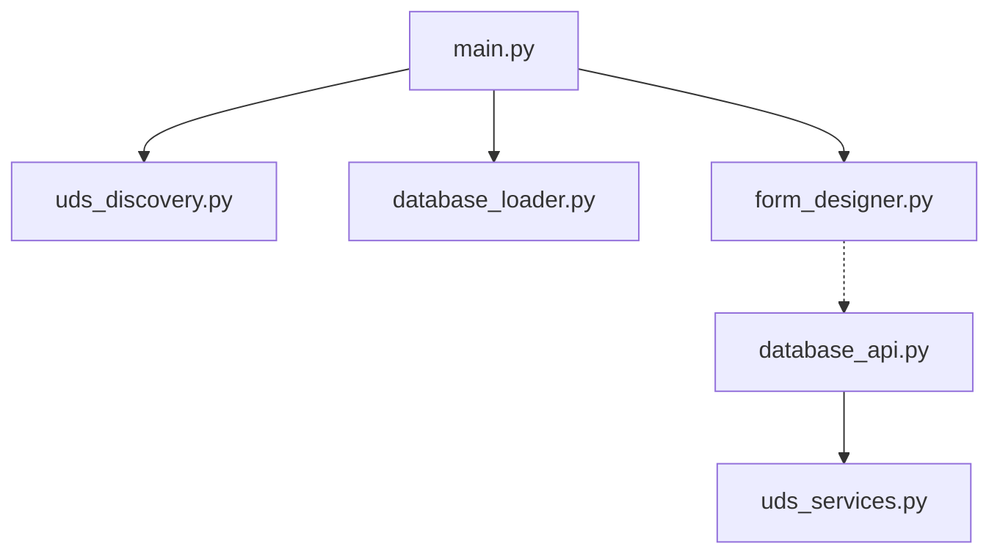
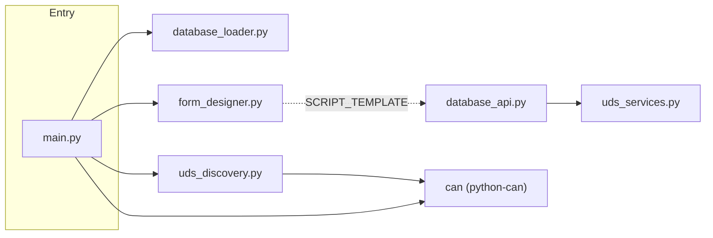
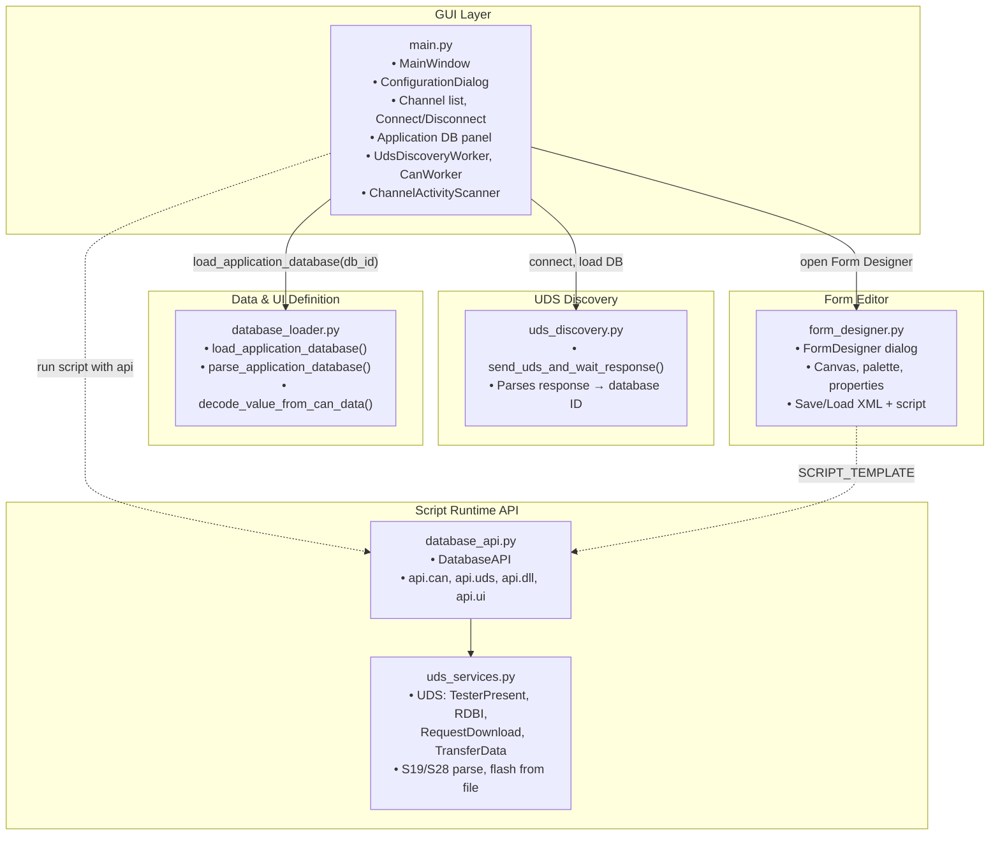
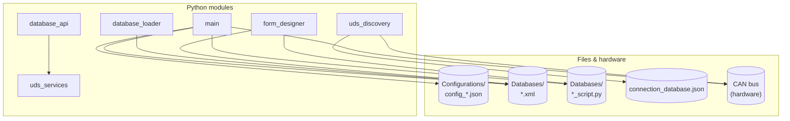
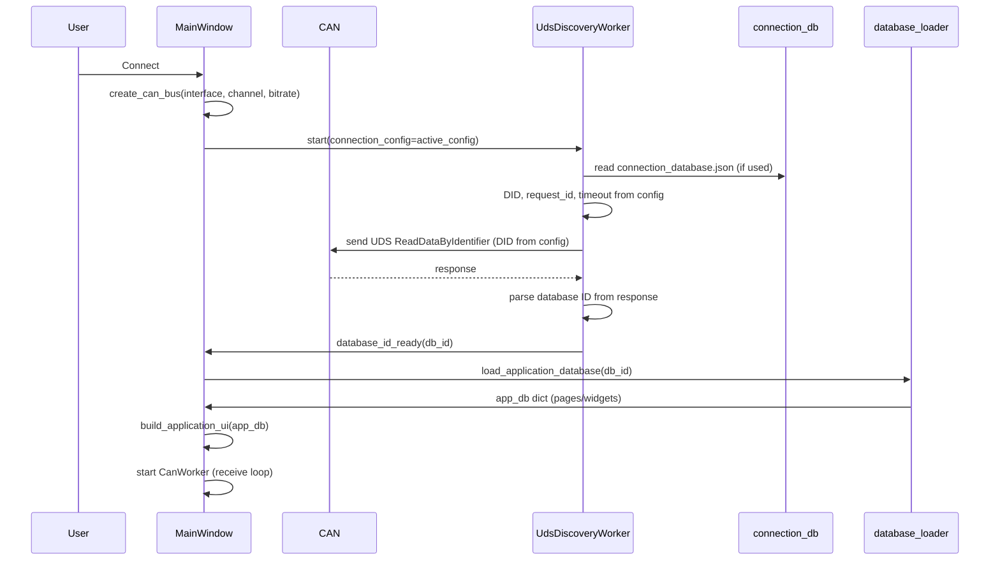
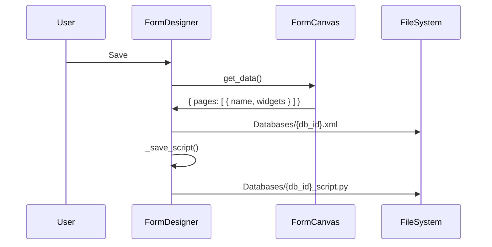
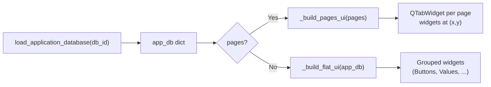

# CAN Expert – Developer Documentation

This document describes the architecture, file interactions, and data flows of **CAN Expert** for developers who need to understand or extend the codebase.

---

## 1. Overview

**CAN Expert** is a PyQt5 desktop application that:

- Connects to CAN hardware (**Kvaser**, **Vector**, **IXXAT**) via **python-can**
- Sends a **UDS ReadDataByIdentifier** request on connect and uses the response to discover an **application database ID**
- Loads the corresponding **application database** (XML) from the `Databases/` folder and builds a dynamic UI (buttons, values, checkboxes, sliders, labels) with optional **pages** and **X,Y positioning**
- Optionally runs a **database script** (`DatabaseMainFunction(api)`) with an API for CAN, UDS, DLL calls, and UI access
- Provides a **Form Designer** to create and edit application databases (drag-and-drop widgets, pages, and a Database code tab)
- Stores **configurations** (bitrate, DID, request/response IDs, timeout, etc.) in the `Configurations/` folder

### Diagram index

| Section | Diagram | What it shows |
|---------|---------|----------------|
| §2 | Import graph | Which .py file imports which (strict dependencies) |
| §3 | Component view | How main.py, discovery, loader, form designer, and script API connect |
| §4 | Data and file flow | Which modules read/write which files and the CAN bus |
| §7 | Connect sequence | Step-by-step Connect + UDS discovery flow |
| §8 | Form Designer Save | Form Designer save to XML + script |
| §9 | Application UI build | From `load_application_database` to pages or flat UI |

---

## 2. Python Module Dependencies (Import Graph)

The diagram below shows **which .py files import which**. An arrow **A → B** means “A imports from B”.

### Simple file connection map



### Detailed import graph



**In words:**

- **main.py** imports **database_loader**, **form_designer**, and **uds_discovery** (and **can**).
- **form_designer.py** optionally imports **database_api** only for `SCRIPT_TEMPLATE` (script template for new databases).
- **database_api.py** imports **uds_services** (UDS helpers and S19/S28 parsing).
- **uds_discovery.py** uses **can** to send/receive; it does not import any other project module.

---

## 3. Connection Between Python Files (Component View)

This diagram shows how the **main application pieces** connect: GUI, discovery, database loading, and script API.



- **Solid arrows**: direct import or direct call.
- **Dashed arrows**: optional or runtime use (e.g. main runs a database script that receives a `DatabaseAPI` instance; Form Designer uses `database_api.SCRIPT_TEMPLATE`).

---

## 4. Data and File Flow (What Talks to What)



| File / folder            | Used by                          | Purpose |
|--------------------------|----------------------------------|--------|
| `Configurations/*.json`  | main.py                          | Load/save connection configs (bitrate, DID, IDs, etc.) |
| `Databases/*.xml`        | main.py, database_loader, form_designer | Application database (form definition) |
| `Databases/*_script.py`  | main.py (when running script), form_designer | Database script (DatabaseMainFunction, Reflash) |
| `connection_database.json` | uds_discovery.py               | UDS request/response IDs and response parsing |
| CAN bus                  | main.py, uds_discovery           | Send/receive CAN frames |

---

## 5. Folder Layout

```
CanExpert/
├── main.py                   # Application entry, main window, workers
├── uds_discovery.py          # UDS send + response parsing (database ID)
├── database_loader.py       # Application database XML → dict
├── database_api.py          # DatabaseAPI for scripts (CAN, UDS, DLL, UI)
├── uds_services.py          # UDS services + S19/S28 parsing
├── form_designer.py         # Form Designer dialog
├── connection_database.json # UDS request/response and response parsing (optional)
├── Databases/               # Application databases and scripts
│   ├── 1001.xml             # Application database (pages, widgets)
│   ├── 1001_script.py       # Optional script (DatabaseMainFunction, Reflash)
│   └── ...
├── Configurations/          # Configuration files
│   ├── config_MyConfig.json
│   └── ...
├── DOCUMENTATION.md         # This file
└── README.md                # User-facing readme
```

- **Databases/**  
  - One XML per application database (e.g. `1001.xml`).  
  - Optional script per DB: `{db_id}_script.py` (e.g. `1001_script.py`). Script can define `DatabaseMainFunction(api)` and `Reflash(api, path)`.

- **Configurations/**  
  - One JSON per configuration: `config_{name}.json`.

---

## 6. Module Summary

| Module | Role |
|--------|------|
| **main.py** | Main window, configuration list, channel list, Connect/Disconnect, UDS discovery worker, builds application UI from DB, Form Designer launcher, CAN log, debug log, theme. |
| **uds_discovery.py** | Sends UDS ReadDataByIdentifier (DID from config), parses response to get database ID; uses `connection_database.json` when present for request/response IDs and parsing. |
| **database_loader.py** | Loads `Databases/{id}.xml`, parses pages/widgets (buttons, values, checkboxes, sliders, labels) with x, y, can_id, variable; `decode_value_from_can_data()` for value display. |
| **form_designer.py** | Form Designer dialog: palette, canvas (drag/drop, move, right‑click), properties, pages; saves XML to `Databases/` and script to `Databases/{id}_script.py`; uses `database_api.SCRIPT_TEMPLATE`. |
| **database_api.py** | `DatabaseAPI` for user scripts: `api.can`, `api.uds`, `api.dll`, `api.ui`, `api.log`; uses `uds_services` for UDS and S19/S28 flashing. |
| **uds_services.py** | UDS helpers (TesterPresent, RDBI, RequestDownload, TransferData), S19/S28 parser, `uds_flash_from_file`. |

---

## 7. Connect and UDS Discovery Flow

When the user selects a configuration, selects a channel, and clicks **Connect**:



- **main.py**: `on_connect_clicked()` → creates bus, starts `UdsDiscoveryWorker` with `connection_config=self.active_config`.
- **uds_discovery.py**: `send_uds_and_wait_response()` → builds payload, sends CAN, waits for response, parses DB ID.
- **main.py**: `on_uds_database_id(db_id)` → `load_application_database(db_id)` → `build_application_ui(app_db)`.

---

## 8. Form Designer Flow (Save)

When the user clicks **Save** in the Form Designer:



- **form_designer.py**: `save()` builds XML from `canvas.get_data()`, writes `Databases/{db_id}.xml`, then writes the code editor content to `Databases/{db_id}_script.py`.

---

## 9. Application UI Build Flow

After a database ID is known, the main window builds the UI from the loaded application database:



- **database_loader.py**: Returns a dict with either `pages` (list of `{ name, buttons, values, checkboxes, sliders, labels }`) or legacy flat lists. Widgets can have `x`, `y`, `can_id`, `variable`, etc.
- **main.py**: `build_application_ui(app_db)` → `_build_pages_ui(pages)` or `_build_flat_ui(app_db)`. Buttons/checkboxes/sliders send CAN only when `can_id` is set; otherwise variable-only (script can use `api.ui.set_value`).

---

## 10. Configuration and Connection Data

### 10.1 Configuration (Configurations/config_*.json)

Example:

```json
{
  "name": "My Config",
  "bitrate": 500000,
  "identifier_11_bit": true,
  "request_id": 2015,
  "response_id": 2024,
  "did": 61680,
  "timeout_ms": 5000,
  "extended_id": false,
  "extended_id_byte": 0
}
```

- **request_id** / **response_id**: CAN IDs for UDS request/response.
- **did**: UDS ReadDataByIdentifier DID (e.g. 0xF1F0).
- **extended_id** / **extended_id_byte**: Optional first byte in UDS payload.

### 10.2 Connection database (connection_database.json)

Used by **uds_discovery.py** when present (request/response IDs and how to parse the response):

```json
{
  "uds_request": {
    "request_id": 2015,
    "response_id": 2024,
    "payload_hex": "03 22 F1 80",
    "timeout_seconds": 2.0
  },
  "response_parsing": {
    "database_id_bytes": [4, 5],
    "format": "decimal",
    "byte_order": "big"
  }
}
```

---

## 11. Application Database XML (Databases/*.xml)

- **With pages** (Form Designer):

```xml
<application_database name="...">
  <description>...</description>
  <pages>
    <page name="Main">
      <button id="1" label="Start" x="10" y="20" ... />
      <value id="2" label="Temp" unit="°C" x="10" y="60" ... />
      ...
    </page>
  </pages>
</application_database>
```

- **database_loader.py** parses this into a dict with `pages` or legacy flat lists. Widgets may have `can_id`, `variable`, and display/scale attributes.

---

## 12. Database Script (Databases/*_script.py)

- Define **`DatabaseMainFunction(api)`** (and optionally **`Reflash(api, path)`** for reflash).
- **api** is a **DatabaseAPI** instance:
  - **api.can.send(id, data)**, **api.can.get_latest_messages()**
  - **api.uds** (tester_present, rdbi, request_download, transfer_data, transfer_data_from_file)
  - **api.dll.load(path)**, **api.dll.call(...)**
  - **api.ui.get_value(name)**, **api.ui.set_value(name, value)**
  - **api.log(msg)**

Form Designer’s Database code tab edits this script and saves it to **Databases/{db_id}_script.py**; the template comes from **database_api.SCRIPT_TEMPLATE**.

---

## 13. Form Designer at a Glance

- **Widget palette**: Drag Button, Value, Checkbox, Slider, Label onto the canvas.
- **Canvas**: Widgets at (x, y); left-drag to move; right-click for Copy, Cut, Paste, Delete, resize, Variable.
- **Pages**: Tabs; each page has its own widgets.
- **Properties**: Selected widget’s id, label, x, y, width, height, variable; value/slider options.
- **Database code tab**: Editor for **Databases/{db_id}_script.py** (template from **database_api.SCRIPT_TEMPLATE**).
- **Save**: Writes XML to **Databases/{db_id}.xml** and script to **Databases/{db_id}_script.py**.

---

## 14. Quick Reference: Where Things Live

| What | Where |
|------|--------|
| Main window, config list, channel list, Connect/Disconnect | **main.py** |
| UDS discovery (send DID, parse DB ID) | **uds_discovery.py** |
| Load application DB XML → dict | **database_loader.py** |
| Build UI from app_db (pages or flat) | **main.py** `build_application_ui`, `_build_pages_ui`, `_build_flat_ui` |
| Form Designer UI and save/load | **form_designer.py** |
| Script API (CAN, UDS, DLL, UI) | **database_api.py** |
| UDS services + S19/S28 | **uds_services.py** |
| Config files (JSON) | **Configurations/config_*.json** |
| Application DB (XML) | **Databases/{id}.xml** |
| Database script | **Databases/{id}_script.py** |
| UDS request/response definition | **connection_database.json** (root) |
