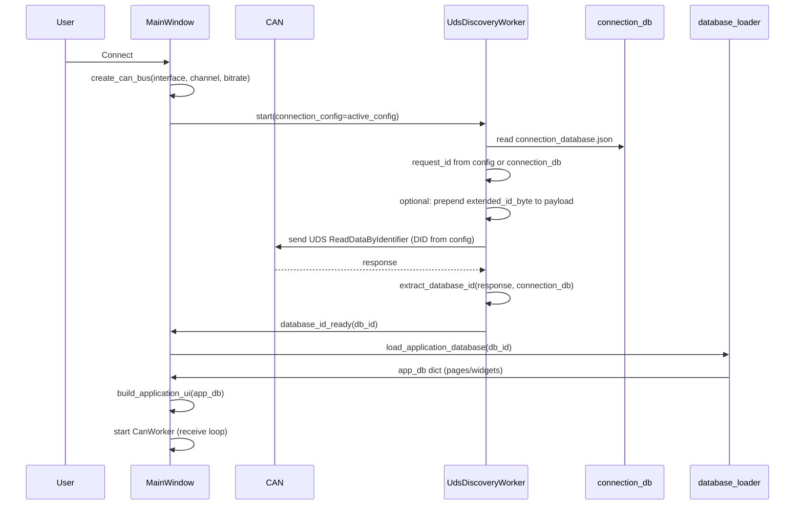
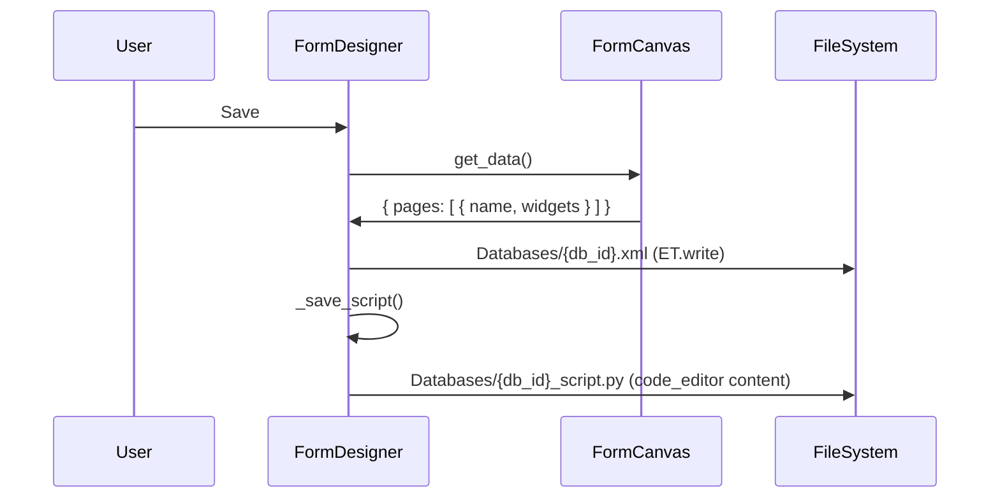
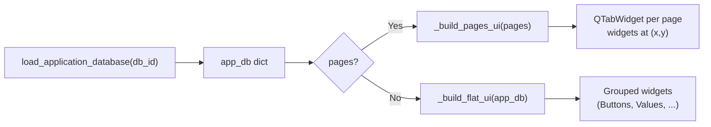

# CAN Expert – Developer Documentation

This document describes the architecture, file interactions, and data flows of **CAN Expert** for programmers who need to understand or extend the codebase.

---

## 1. Overview

**CAN Expert** is a PyQt5 desktop application that:

- Connects to CAN hardware (Kvaser, Vector, IXXAT) via **python-can**
- Sends a **UDS ReadDataByIdentifier** request on connect and uses the response to discover an **application database ID**
- Loads the corresponding **application database** (XML) from the `Databases/` folder and builds a dynamic UI (buttons, values, checkboxes, sliders, labels) with optional **pages** and **X,Y positioning**
- Optionally runs a **database script** (`DatabaseMainFunction(api)`) linked to each database, with an API for CAN, UDS, DLL calls, and UI access
- Provides a **Form Designer** to create and edit application databases (drag-and-drop widgets, pages, variable linking, and a **Database code** tab)
- Stores **configurations** (bitrate, DID, ID, timeout, extended ID byte, etc.) in the `Configurations/` folder

---

## 2. Architecture: Module Dependencies

The following diagram shows how the main Python modules depend on each other. Arrows mean “imports or calls”.

```mermaid
flowchart TB
    subgraph Entry
        main["main.py\n(GUI, workers, config)"]
    end

    subgraph Core
        main --> uds_discovery["uds_discovery.py\n(UDS send/parse)"]
        main --> database_loader["database_loader.py\n(XML → dict)"]
        main --> form_designer["form_designer.py\n(Form Designer UI)"]
    end

    subgraph Script / UDS
        database_api["database_api.py\n(DatabaseAPI for scripts)"]
        database_api --> uds_services["uds_services.py\n(TesterPresent, RDBI, flash)"]
    end

    main -.->|"when script runs"| database_api
    form_designer -.->|"SCRIPT_TEMPLATE"| database_api

    uds_discovery --> connection_db[( "connection_database.json" )]
    database_loader --> xml[( "Databases/*.xml" )]
    main --> config_json[( "Configurations/config_*.json" )]
    form_designer --> xml
    form_designer --> script_py[( "Databases/*_script.py" )]
```

**Summary:**

| Module | Role |
|--------|------|
| **main.py** | Main window, configuration list, channel list, Connect/Disconnect, UDS discovery worker, builds application UI from DB, Form Designer launcher, CAN log, debug log |
| **uds_discovery.py** | Sends UDS request (DID from config, optional extended ID byte), parses response to get database ID; uses `connection_database.json` for request/response IDs and response parsing |
| **database_loader.py** | Loads `Databases/{id}.xml`, parses pages/widgets (buttons, values, checkboxes, sliders, labels) with x, y, variable; decodes values from CAN data |
| **form_designer.py** | Form Designer dialog: palette, canvas (drag/drop, move, right‑click menu), properties, pages, Database code tab; saves XML to `Databases/` and script to `Databases/{id}_script.py` |
| **database_api.py** | `DatabaseAPI` for user scripts: `api.can`, `api.uds`, `api.dll`, `api.ui`, `api.log`; uses `uds_services` for UDS and S19/S28 flashing |
| **uds_services.py** | UDS helpers (TesterPresent, RDBI, RequestDownload, TransferData), S19/S28 parser, `uds_flash_from_file` |

---

## 3. Folder Layout

```
EZCan2/
├── main.py                 # Application entry, main window, workers
├── uds_discovery.py        # UDS send + response parsing
├── database_loader.py      # Application database XML parser
├── database_api.py         # Script API (CAN, UDS, DLL, UI)
├── uds_services.py         # UDS services + S19/S28
├── form_designer.py        # Form Designer dialog
├── connection_database.json # UDS request/response IDs and response parsing
├── Databases/              # Application databases and scripts
│   ├── 1001.xml            # Application database (pages, widgets)
│   ├── 1001_script.py      # Optional script (DatabaseMainFunction)
│   └── ...
├── Configurations/         # Configuration files
│   ├── config_MyConfig.json
│   └── ...
├── DOCUMENTATION.md        # This file
└── readme.md               # User-facing readme
```

- **Databases/**  
  - One XML per application database (e.g. `1001.xml`).  
  - Optional script per DB: `{db_id}_script.py` (e.g. `1001_script.py`).

- **Configurations/**  
  - One JSON per configuration: `config_{name}.json` (e.g. `config_MyConfig.json`).

---

## 4. Connect and UDS Discovery Flow

When the user selects a configuration, selects a channel, and clicks **Connect**, the following happens:



**Relevant code:**

- **main.py**: `on_connect_clicked()` → creates bus, starts `UdsDiscoveryWorker` with `connection_config=self.active_config`.
- **main.py**: `UdsDiscoveryWorker.run()` → reads `connection_database.json`, gets DID/timeout/request_id/extended_id_byte from config, calls `send_uds_and_wait_response()`.
- **uds_discovery.py**: `send_uds_and_wait_response()` → builds payload (optional first byte from config), sends CAN message, waits for response, parses DB ID via `extract_database_id()`.
- **main.py**: `on_uds_database_id(db_id)` → `load_application_database(db_id)` → `build_application_ui(app_db)`.

---

## 5. Form Designer Flow (Save)

When the user edits a form and clicks **Save** in the Form Designer:



- **form_designer.py**: `save()` builds XML from `canvas.get_data()` (pages and widgets with id, label, x, y, width, height, variable, type, etc.), writes to `Databases/{db_id}.xml`, then writes the code editor content to `Databases/{db_id}_script.py`.

---

## 6. Application UI Build Flow

After a database ID is known, the main window builds the UI from the loaded application database:



- **database_loader.py**: `load_application_database(db_id)` returns a dict with either `pages` (list of `{ name, buttons, values, checkboxes, sliders, labels }`) or legacy flat `buttons`, `values`, etc. Each widget can have `x`, `y`, `variable`, and optionally `can_id` (legacy).
- **main.py**: `build_application_ui(app_db)` → if `app_db.get("pages")` then `_build_pages_ui(pages)` (tabs, widgets placed with `move(x,y)`), else `_build_flat_ui(app_db)`. Buttons/checkboxes/sliders only send CAN if `can_id` is set; otherwise they are variable-only (script can use `api.ui.set_value`).

---

## 7. Configuration and Connection Data

### 7.1 Configuration (Configurations/config_*.json)

Each configuration is a JSON file. Example:

```json
{
  "name": "My Config",
  "bitrate": 500000,
  "identifier_11_bit": true,
  "request_id": 2015,
  "did": 61680,
  "timeout_ms": 5000,
  "extended_id": false,
  "extended_id_byte": 0
}
```

- **request_id**: CAN arbitration ID for UDS request (hex in UI, stored as decimal). Used by `uds_discovery` when sending the DID request.
- **did**: UDS ReadDataByIdentifier DID (e.g. 0xF1F0).
- **extended_id**: If true, UDS payload is prefixed with **extended_id_byte** (one byte, 0–255).
- **identifier_11_bit**: false = 29‑bit CAN IDs for the UDS frame.

Validation in **main.py** `ConfigurationDialog.save_config()`: if identifier is 11‑bit and `request_id > 0x7FF`, save is blocked with a warning.

### 7.2 Connection database (connection_database.json)

Defines how the UDS request and response are built/parsed (used by **uds_discovery.py**):

```json
{
  "uds_request": {
    "request_id": 2015,
    "response_id": 2024,
    "payload_hex": "03 22 F1 80",
    "timeout_seconds": 2.0
  },
  "response_parsing": {
    "database_id_bytes": [4, 5],
    "format": "decimal",
    "byte_order": "big"
  }
}
```

- **request_id / response_id**: Used when the configuration does not override **request_id**.
- **payload_hex**: Default UDS payload if DID is not overridden by config.
- **response_parsing**: How to extract the database ID from the response (byte indices, format, byte order).

---

## 8. Application Database XML (Databases/*.xml)

Application databases are stored as XML in **Databases/**.

- **With pages** (Form Designer output):

```xml
<application_database name="...">
  <description>...</description>
  <pages>
    <page name="Main">
      <button id="1" label="Start" x="10" y="20" width="100" height="30" variable="Start"/>
      <value id="2" label="Temp" unit="°C" x="10" y="60" variable="Temp" type="float"/>
      ...
    </page>
  </pages>
</application_database>
```

- Widgets are linked to the **database script** by **variable** (no CAN fields required). Optional legacy attributes (e.g. `can_id`) are still parsed for backward compatibility.
- **database_loader.py** parses this into a dict with `pages` (each page has `buttons`, `values`, `checkboxes`, `sliders`, `labels`) or legacy flat lists.

---

## 9. Database Script (Databases/*_script.py)

Optional script per database, e.g. **Databases/1001_script.py**:

- Must define **`DatabaseMainFunction(api)`**.
- **api** is a **DatabaseAPI** instance (from **database_api.py**):
  - **api.can.send(id, data)**, **api.can.get_latest_messages()**
  - **api.uds** (tester_present, rdbi, request_download, transfer_data, transfer_data_from_file for S19/S28)
  - **api.dll.load(path)**, **api.dll.call(...)**
  - **api.ui.get_value(name)**, **api.ui.set_value(name, value)**, **api.ui.get_widget(name)**
  - **api.log(msg)**

The main application can run this script when a database is loaded (e.g. inject `api` with bus and widget map). Form Designer’s “Database code” tab edits this script and saves it to **Databases/{db_id}_script.py**.

---

## 10. Form Designer at a Glance

- **Widget palette**: Drag widget types (Button, Value, Checkbox, Slider, Label) onto the canvas.
- **Canvas**: Widgets are placed at **(x, y)**; left‑drag to move; right‑click for Copy, Cut, Paste, Delete, Change size, Variable.
- **Pages**: Tabs at the top; each page has its own list of widgets.
- **Properties**: Selected widget’s id, label, x, y, width, height, variable; for value: unit, display type; for slider: min, max.
- **Database code tab**: Editor for **Databases/{db_id}_script.py** (template from **database_api.SCRIPT_TEMPLATE**).
- **Save**: Writes XML to **Databases/{db_id}.xml** and script to **Databases/{db_id}_script.py**.

---

## 11. Quick Reference: Where Things Live

| What | Where |
|------|--------|
| Main window, config list, channel list, Connect/Disconnect | **main.py** |
| UDS discovery (send DID, parse DB ID) | **uds_discovery.py** |
| Load application DB XML → dict | **database_loader.py** |
| Build UI from app_db (pages or flat) | **main.py** `build_application_ui`, `_build_pages_ui`, `_build_flat_ui` |
| Form Designer UI and save/load | **form_designer.py** |
| Script API (CAN, UDS, DLL, UI) | **database_api.py** |
| UDS services + S19/S28 | **uds_services.py** |
| Config files (JSON) | **Configurations/config_*.json** |
| Application DB (XML) | **Databases/{id}.xml** |
| Database script | **Databases/{id}_script.py** |
| UDS request/response definition | **connection_database.json** (root) |

This documentation should be enough for a programmer to follow data flow, find where behaviors are implemented, and extend the software (e.g. new UDS services, script hooks, or UI building rules).
