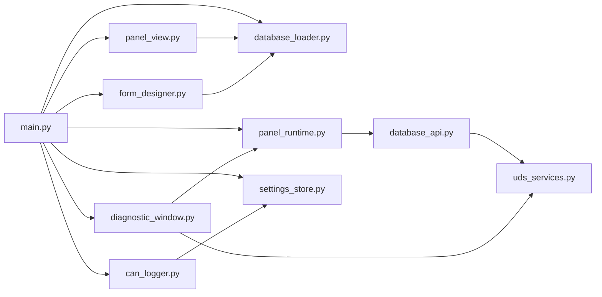
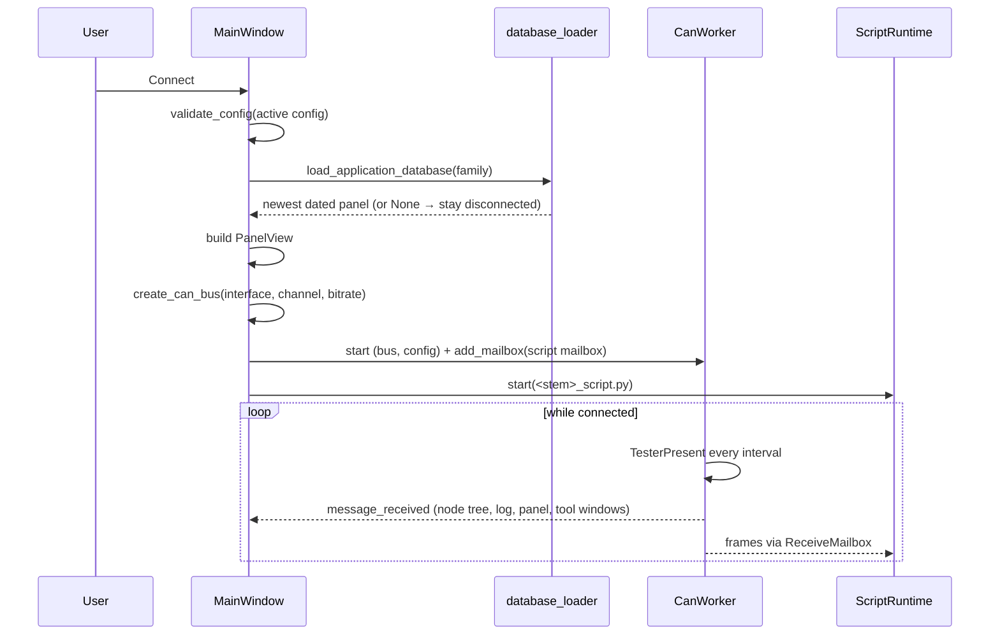
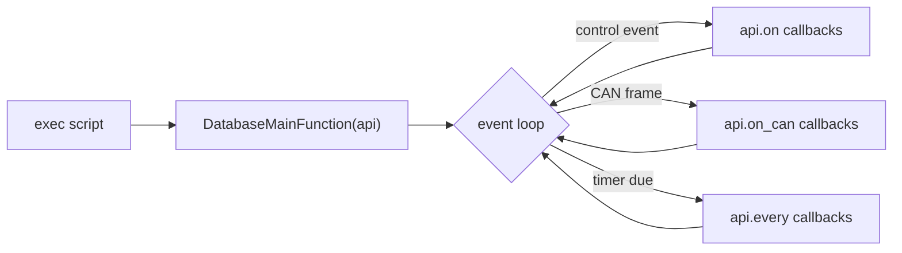

# CAN Expert – Developer Documentation

This document describes the architecture, threads and data flows of **CAN Expert** for developers who need to understand or extend the codebase. User-facing behaviour, the configuration schema and acceptance coverage are in [Requirements implementation](REQUIREMENTS_STATUS.md).

---

## 1. Overview

**CAN Expert** is a PyQt5 desktop application that:

- Connects to CAN hardware (**Kvaser**, **Vector**, **IXXAT**) via **python-can**
- Selects the newest dated **panel database** (`Databases/family_YYYY-MM-DD.xml`) for the active configuration and builds its UI before opening the adapter
- Sends periodic **TesterPresent** and shows responding ECUs beneath the selected receiver, marking lost nodes with a red cross
- Runs the panel's **Python script** (`DatabaseMainFunction(api)`) on a background thread with an API for CAN, UDS over ISO-TP, DLL calls and UI values
- Provides a **Form Designer**, a DBC-aware **CAN Logger**, and an ODX-driven **Diagnostic Window**

---

## 2. Module Map


```mermaid
flowchart LR
    main["main.py"]
    main --> database_loader["database_loader.py"]
    main --> panel_view["panel_view.py"]
    main --> panel_runtime["panel_runtime.py"]
    main --> form_designer["form_designer.py"]
    main --> can_logger["can_logger.py"]
    main --> diagnostic_window["diagnostic_window.py"]
    main --> settings_store["settings_store.py"]
    panel_view --> database_loader
    form_designer --> database_loader
    panel_runtime --> database_api["database_api.py"]
    database_api --> uds_services["uds_services.py"]
    diagnostic_window --> panel_runtime
    diagnostic_window --> uds_services
    can_logger --> settings_store
```

| Module | Role |
|--------|------|
| **main.py** | Main window, configuration list and dialog, receiver/node tree, Connect/Disconnect, `CanWorker` (hardware reader + TesterPresent), `ChannelActivityScanner`, CAN and debug logs, theme. |
| **database_loader.py** | `select_database()` (newest dated file per family), XML → dict parsing, `decode_value_from_can_data()`. |
| **panel_view.py** | `PanelView`: renders pages and controls, decodes raw/DBC-bound values from received frames, emits `control_changed(name, value)`. |
| **panel_runtime.py** | `ScriptRuntime` (script thread, callbacks, timers, cancellation), `ReceiveMailbox` (bus facade fed by `CanWorker`), `validate_config()`. |
| **database_api.py** | `DatabaseAPI` given to scripts: `api.on/on_can/every`, `api.can`, `api.uds`, `api.dll`, `api.ui`, `api.log`. |
| **uds_services.py** | ISO-TP transport (single, first, consecutive and flow-control frames), `uds_request()` and UDS helpers, S19/S28 parsing and flashing. |
| **form_designer.py** | Drag-and-drop designer: pages, controls, script and DBC bindings, script editor; saves XML + `_script.py`. |
| **can_logger.py** | DBC-decoded message table, signal graphs (pyqtgraph), CSV export. |
| **diagnostic_window.py** | Loads ODX/PDX/CDD, builds request forms, runs UDS exchanges on a background thread, monitors request/response IDs. |
| **settings_store.py** | `app_settings()`: persistent QSettings (theme, last configuration), migrating the legacy `EZCan2/KvaserCAN` store once. |
| **splitter_panel.py**, **toolbar_icons.py**, **can_analysis_window.py**, **diagnostic_odx_window.py** | Supporting widgets and windows. |

---

## 3. Files and Folders

```
CanExpert/
├── main.py                 # Entry point: python main.py
├── Configurations/         # config_<name>.json, one per configuration
├── Databases/              # <family>_<YYYY-MM-DD>.xml and matching _script.py
├── examples/               # Runnable panel + script pair (copy to Databases/)
├── DBC/, ODX/              # Default folders for DBC and ODX/PDX files
├── tests/                  # Hardware-free acceptance and UDS transport tests
└── *.py                    # Modules listed above
```

---

## 4. Connect Flow


```mermaid
sequenceDiagram
    participant User
    participant MainWindow
    participant Loader as database_loader
    participant Worker as CanWorker
    participant Runtime as ScriptRuntime

    User->>MainWindow: Connect
    MainWindow->>MainWindow: validate_config(active config)
    MainWindow->>Loader: load_application_database(family)
    Loader-->>MainWindow: newest dated panel (or None → stay disconnected)
    MainWindow->>MainWindow: build PanelView
    MainWindow->>MainWindow: create_can_bus(interface, channel, bitrate)
    MainWindow->>Worker: start (bus, config) + add_mailbox(script mailbox)
    MainWindow->>Runtime: start(<stem>_script.py)
    loop while connected
        Worker->>Worker: TesterPresent every interval
        Worker-->>MainWindow: message_received (node tree, log, panel, tool windows)
        Worker-->>Runtime: frames via ReceiveMailbox
    end
```

Any failure before or during start-up calls `on_disconnect_clicked()`, which leaves Connect available. A `session_generation` counter discards signals from a previous session.

---

## 5. Threads and the Receive Path

`CanWorker` is the **only** reader of the hardware bus. Every received data frame is:

1. emitted to the GUI thread (`message_received`) for the node tree, CAN log, panel decoding, CAN Logger and Diagnostic Window, and
2. pushed into each registered `ReceiveMailbox` (`CanWorker.add_mailbox`).

A mailbox acts as a bus for code running off the GUI thread: `send()` goes straight to the adapter, `recv()` reads the mailbox queue. The panel script owns one mailbox for the whole session; each Diagnostic Window request registers a private mailbox for the duration of its exchange, so the two never compete for replies.

**UDS exchanges** (`uds_services.uds_request`):

- flush the mailbox first, so a reply queued before the request cannot answer it;
- run inside `mailbox.transaction()`; while any mailbox is in a transaction `CanWorker` defers its TesterPresent, because a single frame interleaved with a multi-frame request would abort it on the ECU;
- send the request as ISO-TP (single frame, or first frame + consecutive frames honouring block size and STmin);
- receive the reply, sending flow control for multi-frame replies;
- skip unrelated replies (e.g. TesterPresent) and extend the wait on NRC 0x78 (response pending).

Identifier size (11/29-bit) and the optional extended-address byte come from the configuration and apply to every frame.

---

## 6. Panel Scripts

`ScriptRuntime.start()` compiles `<stem>_script.py` and runs it on a daemon thread:


```mermaid
flowchart LR
    A["exec script"] --> B["DatabaseMainFunction(api)"]
    B --> C{"event loop"}
    C -->|control event| D["api.on callbacks"]
    C -->|CAN frame| E["api.on_can callbacks"]
    C -->|timer due| F["api.every callbacks"]
    D & E & F --> C
```

- Callbacks run serially; exceptions are logged and do not stop the loop.
- `api.ui.set_value()` emits `value_changed`, handled on the GUI thread by `PanelView.set_value()`.
- Disconnect sets the stop event (a `sys.settrace` hook raises inside Python code), closes the mailbox and revokes the script's bus. Blocking native calls cannot be interrupted.

Script API summary (see [Requirements implementation](REQUIREMENTS_STATUS.md#panel-scripts) for details):

| Call | Purpose |
|------|---------|
| `api.on(name, cb)`, `api.on_can(cb)`, `api.every(s, cb)` | Register callbacks |
| `api.can.send(id, data)`, `api.can.get_latest_messages()` | Raw CAN |
| `api.uds.request(payload)` | Any UDS request; returns positive or negative reply, or `None` |
| `api.uds.tester_present()`, `api.uds.rdbi(did)` | Common services (`rdbi` returns the data record without the DID echo) |
| `api.uds.request_download(fmt, addr, size)`, `api.uds.transfer_data(seq, data)`, `api.uds.request_transfer_exit()`, `api.uds.transfer_data_from_file(path, packet_size)` | Flashing |
| `api.dll.load(path)`, `api.dll.call(path, name, *args)` | Native libraries |
| `api.ui.get_value(name)`, `api.ui.set_value(name, value)`, `api.log(text)` | UI and logging |

UDS calls use the configuration's request/response IDs and its **UDS response timeout** (`timeout_ms`) unless a timeout is passed.

---

## 7. Panel Database Format

```xml
<application_database name="engine" dbc_path="../DBC/engine.dbc">
  <description>...</description>
  <pages>
    <page name="Main">
      <button label="Start" binding_value="start" x="10" y="10"/>
      <value label="Status" binding_value="status" x="10" y="50"/>
      <value label="RPM" binding_type="dbc" binding_value="EngineData.RPM" x="10" y="90"/>
      <slider label="Fan" can_id="0x202" byte="0" min="0" max="100" x="10" y="130"/>
    </page>
  </pages>
</application_database>
```

Control types: `button`, `value`, `checkbox`, `slider`, `label`, `text_input`, `gauge`, `progress_bar`, `led`, `combo`, `io_box`. Controls may be driven by a script binding, a DBC `Message.Signal` binding, or legacy raw `can_id`/byte/bit mappings. `database_loader.parse_widget()` is the authority for attribute names; the Form Designer round-trips all of them.

---

## 8. Settings

`settings_store.app_settings()` returns `QSettings("CanExpert", "CanExpert")`. On first use it copies any keys saved under the previous `EZCan2/KvaserCAN` name, so existing theme and last-configuration choices survive the rename.

---

## 9. Testing

```
python -B -m unittest discover -s tests -v
```

- `tests/test_requirements.py`: end-to-end sessions over python-can's virtual interface (configuration restore, heartbeat, node loss/recovery, database selection, scripts, designer round-trip, multi-frame Diagnostic Window exchange).
- `tests/test_uds_services.py`: ISO-TP and UDS against a simulated ECU (stale-frame flush, multi-frame requests/replies, response pending, 29-bit IDs with address byte, RequestDownload encoding, heartbeat deferral flag).

No hardware is contacted. Adapter drivers, bus electrical conditions and ECU timing still need a hardware acceptance run.
