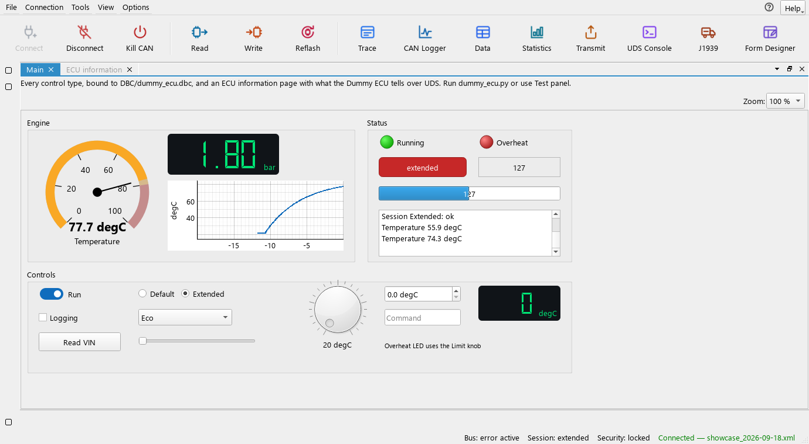

# CAN Expert

**A CANoe-style CAN and UDS workbench, written in Python.** Watch and decode the bus, build panels driven by
Python scripts, diagnose and flash ECUs over UDS, and test them against ISO 14229 — on Kvaser, Vector or IXXAT
hardware, or on the built-in simulated ECU with no hardware at all.

[](https://github.com/HyperFluxQc/CanExpert/actions/workflows/tests.yml)

[](LICENSE)



## Three programs, one toolbox

| Program | What it is for |
|---|---|
| **CAN Expert** | The workbench: the trace, graphs, panels, the UDS console and flashing |
| **TestExpert** | Conformance tests generated from the ECU's CDD, ODX or PDX file |
| **Dummy ECU** | A simulated UDS ECU to develop, demonstrate and test against |

## What it does

- **See the bus** — a Trace that decodes every frame with your DBC files (ISO-TP and J1939 messages joined),
  live graphs with cursors, statistics and bus load, recording to BLF or ASC, and offline replay.
- **Build panels** — 20 controls and drag-and-drop DBC signals, scripted in Python instead of CAPL:
  `@on_message`, `@on_signal`, `@on_timer`, and every UDS service as a function — `RDBI(0xF190)` reads the VIN.
- **Diagnose** — every ISO 14229 service and your ODX services in a UDS console, security access by mask or
  seed & key DLL, the fault memory spelled out, and a scan for the ECUs on the bus.
- **Flash** — S-record and Intel HEX images, with a configurable built-in sequence or your own script, and a
  report of every run.
- **Test** — TestExpert generates conformance tests from the ECU's description, runs your Python test modules
  beside them, compares runs and writes HTML and JUnit reports, from its window or a CI server.
- **Work like CANoe** — docking windows saved as desktops, **Kill CAN** to leave the bus at once, and **Read**,
  **Write** and **Reflash** buttons that run your database's own functions.

## Try it in two minutes — no hardware needed

```bash
pip install -r requirements.txt
python dummy_ecu.py      # the simulated ECU: pick a channel, press Connect
python main.py           # CAN Expert
```

With the Kvaser virtual driver, channels 0 and 1 are wired together: run the Dummy ECU on channel 1, then in
CAN Expert pick the **Dummy ECU** configuration, double-click `[kvaser] Ch 0` and press **Connect**. Flip
**Run** on the showcase panel and the engine warms up; its **ECU information** page reads the VIN, serial
number, versions and fault codes. No CAN driver at all? Open `Databases/showcase_2026-09-18.xml` in the
**Form Designer** and press **Test panel...** — it runs against a simulated ECU on a private virtual bus.

## Windows programs

`python tools/build_windows.py` builds **CanExpert.exe**, **TestExpert.exe** and **DummyECU.exe** into one
zip — unzip anywhere and run, no Python needed (CI builds it for every push to `main` and every `v*` tag).

## Documentation

| Where | What is in it |
|---|---|
| [User manual](docs/USER_MANUAL.md) | Every window, step by step (also in the app: F1) |
| [Requirements implementation](docs/REQUIREMENTS_STATUS.md) | Configurations, panel files, the script API, flashing |
| [Developer documentation](docs/DOCUMENTATION.md) | Architecture, modules, tests and builds |
| `examples/`, `TestModules/` | Example panels, scripts, firmware and a test module |

## Tests and license

`python -m unittest discover -s tests` runs over 700 tests on python-can's virtual bus, so no hardware is
needed; CI runs them on Windows and Ubuntu. CAN Expert is released under the [MIT license](LICENSE).
