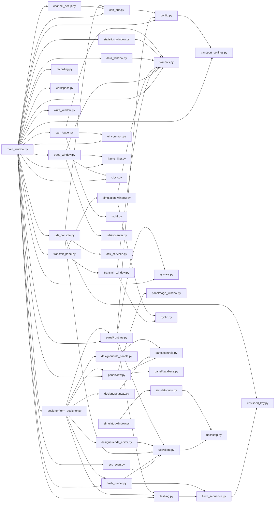
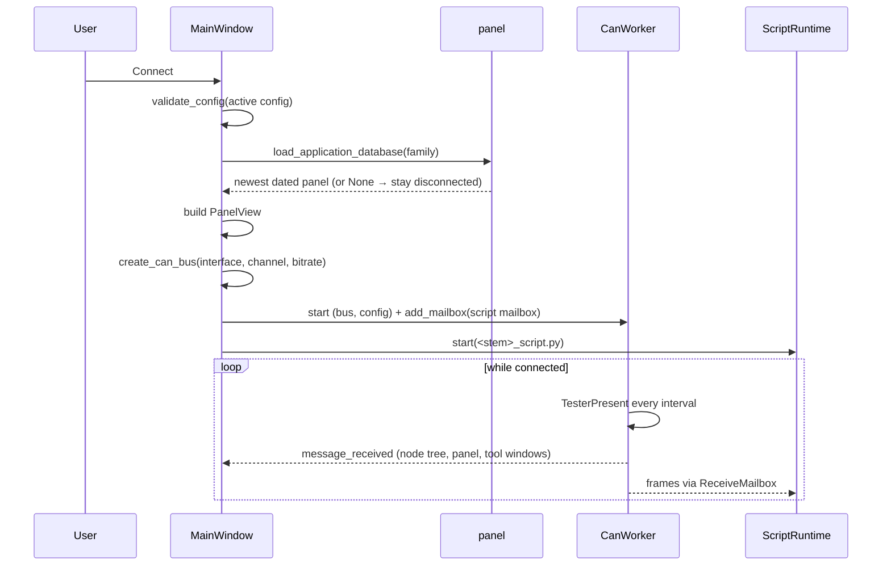
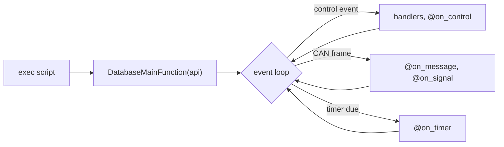

# CAN Expert – Developer Documentation

This document describes the architecture, threads and data flows of **CAN Expert** for developers who need to understand or extend the codebase. User-facing behaviour, the configuration schema and acceptance coverage are in [Requirements implementation](REQUIREMENTS_STATUS.md).

---

## 1. Overview

**CAN Expert** is a PyQt5 desktop application that:

- Connects to CAN hardware (**Kvaser**, **Vector**, **IXXAT**) via **python-can**
- Distributes every frame of the session - received, sent, or replayed from a file - to the tool windows and to an optional recording
- Selects the newest dated **panel database** (`Databases/family_YYYY-MM-DD.xml`) for the active configuration and builds its UI before opening the adapter
- Sends periodic **TesterPresent** and shows responding ECUs beneath the selected receiver, marking lost nodes with a red cross
- Runs the panel's **Python script** (`DatabaseMainFunction(api)`) on a background thread with an API for CAN, UDS over ISO-TP, DLL calls and UI values
- Provides a symbolic **Trace window**, a DBC-aware **CAN Logger**, a **Transmit** window (message list and simulated nodes), a **UDS Console** (every ISO 14229 service, ODX services, fault memory) and a **Form Designer**; the analysis windows and the panel live in a **workspace** where they tab, split and float, and the arrangement is saved
- **Records** the measurement to BLF/ASC/CSV and **replays** a recorded file back into those windows offline

---

## 2. Module Map



| Module | Role |
|--------|------|
| **main_window.py** | Main window: configuration list, receiver/node tree, Connect/Disconnect, `dispatch_frame()` (the one path every frame takes: history, recording, then the `on_frame()` of every open tool window), the ECU check that keeps node status live after Disconnect, recording and replay, the Flashing button with both ways of flashing and their progress, the tool panes and their saved layouts, the debug log, theme. |
| **can_bus.py** | `open_channel()`/`create_can_bus()`, `CanWorker` (the session's only bus reader, which also sends TesterPresent), `ReceiveMailbox` (bus facade for code off the GUI thread). |
| **config.py** | Configuration defaults, `validate_config()`, `diagnostic_request_id()`/`uds_transport()` (the IDs, timing, padding and flow control a session's configuration implies), `read_configurations()`/`save_configuration()`, and `ConfigurationDialog` (any bit rate; its ISO-TP group is saved to the settings, not the file). |
| **transport_settings.py** | ISO-TP per configuration name, kept in the settings: `TransportSettings` (padding on with `0xCC` by default, the block size and STmin the tester asks for), `apply_transport()` folding them into a session's configuration as `isotp_*` keys, `TransportGroup` for the dialog. A configuration without the keys behaves as before. |
| **channel_setup.py** | Per adapter channel, kept in the settings: `ChannelSetup` (sample point, SJW, listen-only, receive filter), `bit_timing()` (a python-can `BitTiming` on the driver's clock), `parse_filters()`/`range_masks()` (identifier ranges cut into aligned id/mask pairs), `open_configured()` (options, filters with the session's response IDs added, `ListenOnlyBus`), `detect_bitrate()` (listen-only at each common rate). `channel_setup_dialog.py` is the dialog and its `BitrateDetector` thread. |
| **frame_filter.py** | The Trace's filter syntax: `parse_filter()` and `FrameFilter` (ranges, names, Pass/Stop, direction). |
| **clock.py** | `MeasurementClock` (the start of the measurement, set at connect, ECU check or replay) and `absolute_text()` (a time of day, or seconds when the timestamp is not one), so every window shows a frame's own time against the same start. |
| **sysvars.py** | System variables: `SystemVariables` (thread-safe values, definitions in the settings or a JSON file, `changed` signal, reset at each measurement) and `SystemVariablesWindow`. |
| **write_window.py** | The Write window: the script's output with its level and time (Absolute or Relative, as *View → Time display* says), level filter, search, save; and `watch_values()` for the Script variables tab. |
| **ecu_scan.py** | `find_responders()` (TesterPresent over an 11-bit range or 29-bit normal fixed addresses), `probe()` (sessions, identification DIDs), `EcuScanner` (a thread; over a session mailbox it holds a transaction so the session's TesterPresent pauses) and `EcuScanDialog`. |
| **mdf4.py** | `write_mdf4()`: a dependency-free ASAM MDF 4.10 writer (a data group with a master time channel per signal, units, the start time). |
| **paths.py** | The data folders (`Configurations/`, `Databases/`, `DBC/`, `ODX/`, `examples/`), next to `main.py` or next to a frozen executable. |
| **panel/database.py** | Panel database files: `select_database()` (newest dated file per family), XML → dict parsing (`parse_widget()`), `decode_value_from_can_data()`. |
| **panel/view.py** | `PanelView`: builds every page as a `PanelWindow` - in tabs, or handed out as `page_windows` for the main window to make each one a workspace window - decodes raw and DBC-bound values, emits `control_changed(name, value)`. |
| **panel/page_window.py** | `PanelPage` (controls at their designed geometry and font, drawn at a zoom factor) and `PanelWindow` (Fit or 50-200 %, Ctrl + wheel). |
| **panel/controls.py** | Control registry shared by the designer and running panels: per control its palette entry, properties, construction, value display and input events; painted controls (gauge, LED, multi-state indicator, toggle switch, knob, 7-segment display, trend); `format_value()` and appearance handling. |
| **panel/runtime.py** | `DatabaseAPI` given to scripts (`api.signal/set_signal/send_message`, `api.can.send`, `api.dll`, `api.ui`, `api.sysvar`, `api.log/write/warn`, `api.progress`; the deprecated `api.on/on_can/every`, `api.can.get_latest_messages` and `api.uds.*` still work), `SCRIPT_TEMPLATE`, `ScriptRuntime` (script thread, handler functions, CAPL-style event decorators - `on_start/stop/timer/message/signal/control/sysvar/key/error_frame/bus_state` - timers, flashing, cancellation; `message(level, text)` for the Write window). |
| **uds/isotp.py** | ISO 15765-2 transport: single, first and consecutive frames, flow control (block size, STmin, WAIT, overflow) in both directions, the escape sequence beyond 4095 bytes. |
| **uds/client.py** | `uds_request()` (one exchange, skipping unrelated replies - periodic `6A <id> <data>` frames too, while it waits for the answer to 0x2A - and extending the wait on NRC 0x78), `make_request()` (a request function bound to one mailbox, for the console and its ODX tab, the flash runner and the scan) and the ISO 14229-1 service functions for scripts (`RDBI`, `WDBI`, `DSC`, `SA`, `RC`, `RD`/`TD`/`RTE`, ... every service except 0x29 and 0x84) returning `UdsResult`; `NRC_NAMES`. `DSC()` learns the P2/P2* the ECU announces and every later request waits that long, never less than the configuration allows. |
| **uds/observer.py** | Reading diagnostics out of plain frames: `assemble()` puts ISO 15765-2 single, first and consecutive frames back together into `TransportMessage`s (escape sequence and extended addressing included, flow control dropped), and `service_name()` names the service from the catalogue in `uds/client.py`. |
| **uds/seed_key.py** | SecurityAccess keys: `xor_key()` for the mask rule, and `load_library()`/`generate_key()`/`dll_key()` for a real ECU's `GenerateKeyEx` DLL (the Vector ABI), with `SeedKeyError` saying what a DLL refused before anything is sent. |
| **flashing.py** | Firmware images: S-record/Intel HEX parsing (`load_firmware()`), and the dialogs shared by the main window and the designer's Test panel - choose a file, `FlashDialog` (which way to flash, with the address ranges), `FlashProfileDialog` (every setting of the built-in sequence, saved and loaded as JSON), progress with Cancel, result. |
| **flash_sequence.py** | Flashing without a panel script: `FlashProfile` (what differs between bootloaders, down to sending `image_crc()` - the CRC-32 of the segments in address order - as the dependency check's option record), `run_flash()` (the ISO 14229 sequence itself), `FlashRun` (the steps taken and the report file). No Qt, so it can be tested on its own. |
| **flash_runner.py** | `FlashRunner`: `run_flash()` on a thread with its own `ReceiveMailbox` on the running measurement, reporting through `progress`, `logged` and `finished` signals - the shape the panel script's flashing already reports through - and writing the report when it ends, either way. |
| **designer/form_designer.py** | The Form Designer dialog: pages, DBC path, save/load of XML + `_script.py`, handler stubs, the script editor tab and Test mode against the simulated ECU. `TestPanelDialog` flashes through the main window's `FlashDialog` - the script's `Flashing()` or the built-in sequence via `FlashRunner`, for which it offers `add_mailbox`/`remove_mailbox`/`message_sent` as a session's worker does. |
| **designer/canvas.py** | The page canvas: widgets to move, resize, select and order, the drop target for palette items and DBC signals, layout tools, clipboard and undo/redo. |
| **designer/side_panels.py** | Control palette, DBC symbol list and the schema-driven property editor, with the designer's shared constants and naming helpers. |
| **designer/code_editor.py** | Python editor for panel scripts: syntax highlighting, line numbers, auto-indent, completion (the current API without the deprecated calls, control names, DBC signals, UDS functions), syntax check; `UdsFunctionPanel` lists the UDS functions by ISO 14229 functional unit and inserts calls. |
| **can_logger.py** | CANoe-style graphics window: DBC signal tree (filter, a System variables branch; the current values are the Data window's), samples capped per signal (`_Series` drops its oldest quarter), one strip chart per ticked signal on a shared time axis or several signals in one graph with a legend (`graph_groups()`/`set_graph_group()`), statistics between the cursors, `export()` as long or wide CSV, MDF 4 or PNG, a symbol toolbar (clear, pause/resume, follow, fit, Lock X / Lock Y for mouse zoom and pan, measurement cursors) whose icons follow the theme, two white dashed measurement cursors labelled #1 and #2 with per-signal values and Δ, a dotted hover crosshair with a time/value readout, Graph options (drawing style: step line, line with dots or dots; follow window; exact time and value ranges), CSV export of all decoded data. |
| **trace_window.py** | The Trace: frames buffered and flushed to a tree on a timer, symbolic names and lazily decoded signals from `symbols.py`, absolute/relative/delta time, pass and stop filters (`parse_filter()`), find, colour per identifier, CSV export; at most `MAX_ROWS` frames. **Transport** rebuilds the view from `uds/observer.py`, a row per diagnostic message instead of per frame. |
| **statistics_window.py** | `Statistics`: frames per identifier with their rate, average/min/max cycle time and share of the bus (`frame_bits()` counts the overhead and worst-case stuffing), plus error frames and the controller state; `StatisticsWindow` shows them with freeze, filter, reset and CSV export (the bytes are the Trace's). Rates are measured against the newest frame while a file is replayed, so a recording keeps its own timing. |
| **data_window.py** | `SignalValues`: the newest value of every signal, physical and raw (`decode(..., scaling=False)`), with its unit, age and count; `DataWindow` lists them beside the signals of the databases that have not arrived. |
| **simulation_window.py** | Simulated nodes: a branch per `message.senders` entry with its messages, the data editable signal by signal, sent at their cycle times by one timer through `CyclicSchedule`. What was ticked is remembered. The *Simulated nodes* tab of the Transmit window. |
| **cyclic.py** | `CyclicSchedule`: when each key of a set is next due. Shared by the transmit list and the simulated nodes so the drift arithmetic - due at `t + cycle`, not "now + cycle", without queueing up a backlog after a long gap - lives in one place. |
| **transmit_window.py** | The transmit list: rows (raw or bound to a database message) in a table, `tick()` sends the ones whose cycle time has come, `SignalEditor` re-encodes a message signal by signal, rows stored as JSON in the settings or a file. A row that fails to send switches itself off. The *Messages* tab of the Transmit window. |
| **transmit_pane.py** | `TransmitPane`: the Transmit window, the transmit list and the simulated nodes as two tabs. Both pages are built with `stop_when_hidden=False`, so they keep sending behind another tab; the main window calls `stop_sending()` when the pane is closed. `open_transmit(nodes=True)` brings the nodes tab to the front. |
| **uds_console.py** | The UDS console: a service tree built from `uds.client.FUNCTIONS`, a request form generated from each function's signature (`_field()`/`_arguments()`), exchanges on a background thread over a private mailbox (`uds.client.make_request()`), the ODX tab (`odx_services.OdxTab`) whose requests go through the same exchange and whose layer decodes every answer once a file is loaded, log lines with the measurement time, the session/security bar with the state strip (session, the P2/P2* the ECU asked for, lock state) and the key source (mask or seed & key DLL), and a fault-memory tab (`status_text()` spells out the DTC status bits). |
| **recording.py** | `Recorder` (python-can writers, format by file name), `read_frames()`, `ReplayWorker` (a thread that hands frames back at their recorded spacing) and `ReplayDialog`. |
| **workspace.py** | The central workspace: the Qt Advanced Docking System (PyQtAds) configured for CAN Expert (`create_workspace()`), the windows put into it (`make_pane()`, `add_pane()`, `set_content()` for a window made before its content), and `pane_names()` - the windows a saved state places. |
| **symbols.py** | `SymbolDatabases`: the DBC files the application shares (paths in the settings), frame id → message, `decode()`, `signal_names()`, `unit()`, and the dialog that edits the list. A file that cannot be read lands in `errors` without failing the others. |
| **odx_services.py** | ODX with odxtools: `load_database()` (ODX/PDX/CDD), `first_layer()`, `services()`, `decoded()` (a reply decoded by the service that asked, or by the layer), and `OdxTab`, the console tab that lists a layer's services and builds their request forms. |
| **simulator/ecu.py** | The simulated UDS ECU for Kvaser virtual channels or any python-can interface: sessions, security levels (mask or seed & key DLL, `security_levels()`), service rules (`service_rules()`), DID tables whose entries can follow a signal or need a session or a level (`data_tables()`), periodic data (0x2A, `_send_periodic()`), ResponseOnEvent (0x86, `_fire_events()`), I/O control (0x2F) over the signals, memory by address (0x23/0x3D, `write_memory()` merging segments), flashing with a bootloader that takes over after a reset with an invalid application and an optional CRC-32 check, ISO-TP flow control, and transport errors on purpose (`_Mistaken`, `_chance()`). `tick()` does what the ECU does by itself - application frames, periodic data, events, the operation cycle timer, the S3 timeout - and `serve()` runs it with the receive loop. The channel lock goes by request ID, so several can share a channel. `EcuConfig` holds every setting and is read for each frame, so changes apply while running (`refresh()` takes changed tables and signals); `load_profile()`/`save_profile()` store it as JSON, `check_config()` refuses a broken one; `main()` opens the window, or runs headless with `--console`. |
| **simulator/signals.py** | The ECU's application traffic: `SignalSimulation` loads a DBC (`BUILTIN_DBC`, the same as `DBC/dummy_ecu.dbc`, or a file), gives each signal a generator (`GENERATORS`; `DEFAULT_GENERATORS` reproduce the ECU's usual 0x300/0x301 traffic), schedules each message at its period (`due_frames()`), keeps values within the signal's bits (`to_raw()`), and lets I/O control hold a signal (`override()`/`release()`). No Qt. |
| **simulator/dtc.py** | The ECU's fault memory: `DtcMemory` with status bytes following faults through operation cycles (pending, confirmed after `confirm_cycles`, aged out after `aging_cycles`), the snapshot captured and the occurrence counted when a fault appears, frozen by ControlDTCSetting, cleared by 0x14; every change is queued for ResponseOnEvent. `status_text()` names the bits. No Qt. |
| **simulator/window.py** | Dummy ECU window: connection (interface, channel detection, bit rate, Connect/Disconnect with the one-ECU-per-channel lock), settings tabs (addressing, flow control, UDS timing and periodic data, access, flashing and the bootloader, signals, data with faults and the fault memory, errors) applied live and remembered in QSettings, the ECU's status, log with an optional frame trace, JSON profiles. |
| **help_window.py** | The user manual window: renders `docs/USER_MANUAL.md` with a list of its sections and a find box; `show_manual()` keeps one window and raises it. |
| **ui_common.py** | Shared Qt helpers: `app_settings()` (the persistent QSettings), `toolbar_icon()`, `TOOL_ICONS` and `ToolButtonsMixin` (the small symbol buttons of the Trace and the CAN Logger), `write_tree_csv()` (the Data and Statistics exports), `CaptionButton`, `SplitterPanel` and `DockTitleBar`. |

---

## 3. Files and Folders

```
CanExpert/
├── main.py                     # Start CAN Expert
├── dummy_ecu.py                # Start the Dummy ECU (window, or --console)
├── canexpert/
│   ├── main_window.py          # Main window: configurations, receivers and ECU nodes, Connect, Flashing
│   ├── can_bus.py              # Opening a bus, CanWorker (reader + TesterPresent), mailbox
│   ├── config.py               # Configuration defaults, validation, UDS transport, files, dialog
│   ├── paths.py                # Where the data folders are (also next to a frozen executable)
│   ├── flashing.py             # S-record / Intel HEX files and the flashing dialogs
│   ├── flash_sequence.py       # The built-in ISO 14229 flashing sequence and its profile
│   ├── flash_runner.py         # That sequence on a thread, reporting to the window
│   ├── can_logger.py           # CAN Logger: CANoe-style graphs, one or several signals per graph
│   ├── trace_window.py         # Trace: every frame, symbolic, filtered, exportable; transport view
│   ├── statistics_window.py    # Statistics: rates, cycle times, bus load, error frames, bus state
│   ├── data_window.py          # Data: every signal with the value it holds now
│   ├── transmit_pane.py        # The Transmit window: the two tabs below
│   ├── transmit_window.py      # Transmit list: one-shot and cyclic messages
│   ├── simulation_window.py    # Simulated nodes: a database's messages sent as those ECUs would
│   ├── cyclic.py               # When each of a set of messages is next due
│   ├── uds_console.py          # UDS Console: every ISO 14229 service, ODX services, the fault memory
│   ├── odx_services.py         # ODX files, their services and the console's ODX tab
│   ├── transport_settings.py   # ISO-TP padding and the tester's flow control, per configuration
│   ├── channel_setup.py        # Sample point, listen-only, receive filter, bit rate detection
│   ├── channel_setup_dialog.py # ... and its dialog
│   ├── frame_filter.py         # The Trace's filter
│   ├── clock.py                # One measurement clock for every window
│   ├── sysvars.py              # System variables and their window
│   ├── write_window.py         # The Write window: script output and variables
│   ├── ecu_scan.py             # Scan for ECUs
│   ├── mdf4.py                 # MDF 4 writer for the Logger's export
│   ├── recording.py            # Recording to BLF/ASC/CSV and offline replay
│   ├── symbols.py              # The DBC files every window shares
│   ├── workspace.py            # The workspace: the docking system the windows live in
│   ├── ui_common.py            # Settings, toolbar icons, caption buttons, dock and splitter panels
│   ├── panel/                  # database.py (files), view.py (running panel), page_window.py, controls.py,
│   │                           #   runtime.py
│   ├── designer/               # form_designer.py, canvas.py, side_panels.py, code_editor.py
│   ├── uds/                    # isotp.py (ISO 15765-2), client.py (requests + ISO 14229 functions),
│   │                           #   observer.py (frames back into messages), seed_key.py (security keys)
│   └── simulator/              # ecu.py (the simulated ECU), signals.py (its application frames),
│                               #   dtc.py (its fault memory), window.py (its window)
├── Configurations/             # config_<name>.json, one per configuration
├── Databases/                  # <family>_<YYYY-MM-DD>.xml and matching _script.py
├── DBC/, ODX/                  # Default folders for DBC and ODX/PDX files
├── examples/                   # Runnable panel + script pair, demo firmware
├── docs/                       # USER_MANUAL.md, DOCUMENTATION.md, REQUIREMENTS_STATUS.md
├── tests/                      # Hardware-free acceptance, UDS and UI tests
└── requirements.txt
```

---

## 4. Connect Flow



Any failure before or during start-up calls `on_disconnect_clicked()`, which leaves Connect available. A `session_generation` counter discards signals from a previous session.

### One path for every frame

`dispatch_frame(timestamp, direction, id, data, extended)` is the single point every frame passes
through, wherever it comes from — the session worker, the ECU check, a frame CAN Expert sent, or a file
being replayed. It appends to `frame_history` (the last `FRAME_HISTORY` frames, so a window opened later
can be filled in), writes to the `Recorder` if one is running, and hands the frame to every open tool
window that takes frames - the Trace, Statistics, Data and the CAN Logger. Received frames carry the adapter's
timestamp (`message.timestamp`), so every window shares one clock.

---

## 5. Threads and the Receive Path

`CanWorker` is the **only** reader of the hardware bus. Every received data frame is:

1. emitted to the GUI thread (`message_received`) for the node tree, panel decoding and the tool windows, and
2. pushed into each registered `ReceiveMailbox` (`CanWorker.add_mailbox`).

A mailbox acts as a bus for code running off the GUI thread: `send()` goes straight to the adapter, `recv()` reads the mailbox queue. The panel script owns one mailbox for the whole session; each UDS Console request (a service, a raw request or an ODX service) and the built-in flashing sequence register a private mailbox for the duration of their exchange, so they never compete for replies.

**UDS exchanges** (`uds.client.uds_request`):

- flush the mailbox first, so a reply queued before the request cannot answer it;
- run inside `mailbox.transaction()`; while any mailbox is in a transaction `CanWorker` defers its TesterPresent, because a single frame interleaved with a multi-frame request would abort it on the ECU;
- send the request as ISO-TP (ISO 15765-2): a single frame, or a first frame and consecutive frames paced by the ECU's flow control. A new ContinueToSend is awaited after every block of BS frames, and consecutive frames are at least STmin apart (timed with `perf_counter`, since `time.sleep()` can overshoot a 1 ms STmin by ~15 ms on Windows). WAIT restarts the N_Bs timeout (1 s, at most 16 WAITs), and overflow, an invalid flow status or no flow control abort with `IsoTpError`;
- receive the reply, answering a first frame with flow control (BS 0, STmin 0: the whole reply at once); a first frame that announces a length a single frame could carry is ignored, a new single or first frame replaces an unfinished message, and a wrong sequence number or more than N_Cr (1 s) between consecutive frames aborts;
- messages longer than 4095 bytes use the ISO 15765-2:2016 escape sequence (first-frame length 0, then 32 bits) in both directions;
- skip unrelated replies (e.g. TesterPresent) and extend the wait on NRC 0x78 (response pending).

Identifier size (11/29-bit) and the optional extended-address byte come from the configuration and apply to every frame.

---

## 6. Panel Scripts

`ScriptRuntime.start()` compiles `<stem>_script.py` and runs it on a daemon thread:



- Callbacks run serially; exceptions are logged and do not stop the loop.
- `api.ui.set_value()` emits `value_changed`, handled on the GUI thread by `PanelView.set_value()`.
- Disconnect sets the stop event (a `sys.settrace` hook raises inside Python code), closes the mailbox and revokes the script's bus. Blocking native calls cannot be interrupted.

Script API summary (see [Requirements implementation](REQUIREMENTS_STATUS.md#panel-scripts) for details):

| Call | Purpose |
|------|---------|
| Handler functions, `@on_control`, `@on_message`, `@on_signal`, `@on_timer`, `@on_sysvar`, `@on_key`, ... | React to events |
| `UDS(payload)`, `RDBI(did)`, `RD`, `TD`, `RTE`, ... | ISO 14229 services over ISO-TP, returning `UdsResult` |
| `api.can.send(id, data)`, `api.signal`, `api.set_signal`, `api.send_message` | Raw CAN and DBC signals |
| `api.progress(done, total, message)`, `api.flash_cancelled` | Flashing progress and cancellation |
| `api.dll.load(path)`, `api.dll.call(path, name, *args)` | Native libraries |
| `api.ui.get_value(name)`, `api.ui.set_value(name, value)`, `api.sysvar` | UI and system variables |
| `api.log(text)` / `api.write(text)`, `api.warn(text)` | The Write window |

**Deprecated**, kept working for existing scripts but no longer offered by completion: `api.on`
(use `@on_control`), `api.on_can` (`@on_message`), `api.every` (`@on_timer`),
`api.can.get_latest_messages` (`@on_message`), and `api.uds.request`, `tester_present`, `rdbi`,
`request_download`, `transfer_data`, `request_transfer_exit`, `transfer_data_from_file`,
`parse_s19_s28` (the service functions, the firmware `Flashing()` is given, or the built-in sequence).
Their docstrings say what replaces them.

UDS calls use the configuration's request/response IDs and its **UDS response timeout** (`timeout_ms`) unless a timeout is passed.

---

## 7. Firmware Flashing


The button is visible while connected, and `FlashDialog` asks which of the two ways to use; the script's `Flashing()` is offered only when the loaded script defines one. The Form Designer's Test panel uses the same dialog and both ways against the simulated ECU.

**With the script.** Flashing runs on the script thread, so other script callbacks wait until it finishes. Cancel sets `api.flash_cancelled`; disconnecting stops the script. The TesterPresent heartbeat keeps running between requests, which keeps the programming session alive. See [Firmware flashing](REQUIREMENTS_STATUS.md#firmware-flashing) for the sample ISO 14229 sequence.

**Without one.** `flash_sequence.run_flash(uds, firmware, profile, progress, cancelled, log, run)` sends the sequence a bootloader normally wants, with everything that differs between ECUs in a `FlashProfile`: session numbers, ControlDTCSetting and CommunicationControl, the SecurityAccess level and how the key is computed (mask or `GenerateKeyEx` DLL), the erase and check routines, the address and data format identifiers, the bytes per TransferData, the reset type and the DID read afterwards. A field of 0 leaves that step out. Block size is `min(profile.block_size or announced, announced)` where `announced = min(maxNumberOfBlockLength, 4095) - 2` - the SID and the block counter come off it.

`FlashRunner` (`flash_runner.py`) runs that on a thread with its own `ReceiveMailbox`, so the Qt thread stays free, and emits `progress`, `logged` and `finished` exactly as the script path does - `MainWindow._on_flash_progress()` and `_on_flash_finished()` serve both. The caller passes its own `FlashRun` in, so the report of a run that fails halfway still holds the steps that did happen; the report is written beside the firmware as `<firmware>.flash-report.txt` whatever the outcome. The profile last used is kept in the settings under `flash_profile`, and `FlashProfileDialog` saves and loads profile files.

---

## 8. Panel Database Format

```xml
<application_database name="engine" dbc_path="../DBC/engine.dbc">
  <description>...</description>
  <pages>
    <page name="Main">
      <button label="Start" binding_value="start" x="10" y="10"/>
      <value label="Status" binding_value="status" x="10" y="50"/>
      <value label="RPM" binding_type="dbc" binding_value="EngineData.RPM" x="10" y="90"/>
      <slider label="Fan" can_id="0x202" byte="0" min="0" max="100" x="10" y="130"/>
    </page>
  </pages>
</application_database>
```

Control types (see `panel.controls.CONTROLS`): `button`, `switch`, `checkbox`, `radio`, `combo`, `slider`, `knob`, `spin`, `io_box`, `text_input`, `value`, `display`, `gauge`, `progress_bar`, `led`, `indicator`, `trend`, `output`, `label`, `group_box`, `picture`. Controls may be driven by a script binding, a DBC `Message.Signal` binding (the panel takes the signal's unit and value table), or legacy raw `can_id`/byte/bit mappings. A `handler` attribute names the script function an input calls. Element order within a page is the z-order. `panel.database.parse_widget()` parses the common attributes; control-specific attributes are kept as-is and interpreted by `panel.controls`.

---

## 9. Settings

`ui_common.app_settings()` returns `QSettings("CanExpert", "CanExpert")`.

Nothing below is written to a configuration or panel file; features that must remember something use the
settings or a file of their own:

| Key | Holds |
|---|---|
| `theme`, `last_configuration`, `last_channel`, `used_channels` | Appearance and what was in use last |
| `symbol_databases` | The DBC paths every window shares (`symbols.py`) |
| `transmit_list` | The transmit rows (`transmit_window.py`); **Save list...** writes a JSON file instead |
| `simulated_messages` | The messages ticked in the Transmit window's simulated nodes (`simulation_window.py`) |
| `flash_profile` | The built-in flashing sequence as JSON (`flash_sequence.FlashProfile`); **Save profile...** writes a file instead |
| `transport/<configuration>` | ISO-TP padding and flow control of a configuration (`transport_settings.py`) |
| `channel_setup/<channel key>` | Sample point, SJW, listen-only and receive filter of an adapter channel (`channel_setup.py`) |
| `system_variables` | The system variable definitions (`sysvars.py`); **Save...** writes a JSON file instead |
| `panel_zoom/<family>/<page>` | The zoom of each panel page |
| `time_display` | Absolute or Relative, for the Write window and the UDS Console |
| `layout/geometry`, `layout/state`, `layout/desktops/<name>` | The window arrangement and the saved desktops |

## 10. The workspace

The window system has two halves:

- **Fixed panels** - Configuration, CAN Channels and Log - stay `QDockWidget`s in the main window's own
  dock areas, with the `DockTitleBar` that minimises them to a strip. `_minimize_side_panels()` on
  connect and `_restore_side_panels()` on disconnect act on those.
- **The workspace** is a `CDockManager` (PyQtAds) as the main window's central widget. The Database
  panel and every tool window are `CDockWidget`s in it, so they tab together, split an area, float as
  windows of their own and show drop guides while being dragged. `workspace.py` holds the
  configuration.

Every workspace window has its `CDockWidget` from the start: the Database window, a pane per tool in
`TOOL_PANES` (`_tool_slots`, empty and closed), and a pane per page of the databases seen
(`_page_slots`, made on demand and kept, empty, between databases). A saved state only places the
windows that exist when it is applied, and places them once: `MainWindow.open_tool(name, title, factory)`
builds a tool on first use and puts it into its pane with `set_content()`, where the arrangement left
it; `tool_widget(name)` returns an already-open one, which is what `dispatch_frame()` asks who needs a
frame. Nothing re-applies a state when a window is opened, so opening one never moves, opens or closes
another.

The toolbar action of each window in `TOOL_PANES` is checkable and works as a switch: `_toggle_tool()`
opens or closes it, and the pane's `viewToggled` signal keeps the button in step whichever way the
window was opened or closed - its tab's close button, a saved desktop or Reset layout. A closed window
is hidden rather than destroyed, so it keeps what it recorded.

`layout_state()` returns both halves (`QMainWindow.saveState()` and `CDockManager.saveState()`) and
`apply_layout_state()` puts them back; the saved layout, the desktops and Reset layout all go through
that pair. It first makes the page panes the state names (`pane_names()` reads them from the compressed
XML), and afterwards `_settle_panes()` applies what the state cannot know: a window with nothing to
show - the Database with no database loaded, a tool not opened yet, a page the database does not have -
is closed again, keeping its place, and a window the state does not know at all (saved before it
existed) is put back at its usual place, since PyQtAds would otherwise leave it out of the workspace and
reopen it floating. `_default_layout`, captured before the first restore, is what **Reset layout** goes
back to. An embedded dialog's `finished` signal (Esc) closes its pane instead of leaving an empty one.

---

## 11. Testing

```
python -B -m unittest discover -s tests -v
```

- `tests/test_requirements.py`: end-to-end sessions over python-can's virtual interface (configuration restore, heartbeat, node loss/recovery, the ECU check after Disconnect, database selection, scripts, designer round-trip, a multi-frame ODX exchange from the UDS Console, Flashing button).
- `tests/test_uds_services.py`: ISO-TP flow control frame by frame (block size and STmin, WAIT, overflow, invalid flow status, N_Bs timeout, flow control after every received block, unexpected and invalid frames, the escape sequence), ISO-TP and UDS against a simulated ECU (stale-frame flush, multi-frame requests/replies, response pending, 29-bit IDs with address byte, RequestDownload encoding, heartbeat deferral flag), S-record/Intel HEX parsing, and the example `Flashing()` against a simulated bootloader.

- `tests/test_dummy_ecu.py`: the simulated ECU's session, security, functional addressing, S3 timeout, DTC, flow control (WAIT, block size, STmin, overflow) and flashing behaviour, and its settings: RequestDownload formats, memory ranges, block length and full blocks, RequestUpload read-back, security level/seed/mask, P2/P2* and response pending on a slow response.
- `tests/test_dummy_ecu_window.py`: the Dummy ECU window connecting and disconnecting on a virtual bus (channel lock included), settings applied while connected, invalid text fields not applied, the log and frame trace, profiles and remembered settings, and the simulation's tabs: generators changed while running, another DBC, security levels, service rules, error rates, faults and operation cycles, the bootloader settings and the status.
- `tests/test_dummy_ecu_features.py`: the Dummy ECU's simulation over a virtual bus - every generator, a DBC of one's own, values kept within their bits; I/O control taking a signal over; periodic data at its rates, stopped, or on an ID of its own; ResponseOnEvent on a DID change and a DTC status change; the fault memory's life cycle, snapshot, occurrence counter, frozen and cleared; transport errors on purpose; DIDs and services needing a session or a level, several levels, a seed & key DLL; the bootloader after a failed flash, the CRC-32 check, the version from the image, and the built-in sequence sending the CRC; memory by address.

- `tests/test_recording_and_workspace.py`: the frame history with the adapter's timestamps, the ECU check feeding the Trace, a window opened later filled from the history, recording to a file and replaying it offline, the workspace windows (tabbing, floating, the toolbar switches) and the saved layout and desktops.
- `tests/test_trace_window.py`: symbolic rows and lazily decoded signals, the three time modes, pass and stop filters, pause, find, CSV export, colours, and `SymbolDatabases` (decoding, a broken file, adding and removing).
- `tests/test_transmit_window.py`: editing rows, rejecting bad input, a database message and its signal editor, sending once and cyclically, a failing row switching itself off, and the list surviving a restart.
- `tests/test_can_logger.py`: the symbol toolbar, graph colours, graph options, cursors, a graph per signal or several in one, decoding and plotting, the crosshair, axis locks, follow/pause/fit, the filter, CSV export, and the shared symbol databases.
- `tests/test_form_designer.py`: the palette, signals dropped as bound controls, the layout tools, undo/redo, clipboard, saving and loading, completion offering the current API only, and the Test panel - running against the simulated ECU and flashing it with the script's `Flashing()` or the built-in sequence.
- `tests/test_uds_console.py`: the service tree, forms built from each function's signature (order, defaults, byte parameters, the security key, a missing required parameter), the ODX tab's forms and decoding, the log's time, and a live exchange with the simulated ECU: a multi-frame VIN, an NRC named, session and security, and the fault memory read and cleared.
- `tests/test_help_window.py`: the manual covers every window it promises and names what the user clicks; the help window lists its sections, jumps to a heading, finds text, and says so when the file is missing.
- `tests/test_can_bus.py`: opening adapters, so that a channel dictionary from `can.detect_available_configs()` (with its device name, serial and dongle channel) opens as it is and only adapter options reach python-can.
- `tests/test_statistics.py`: the counting itself (rate, cycle time, min/max, the frame bits behind the bus load, error frames and the bus state) and the window around it - filter, freeze, reset, CSV export - including a replayed file being counted at its own timestamps.
- `tests/test_data_window.py`: physical and raw values, units, age and count, the signals of the databases that never arrived, the filter and the export.
- `tests/test_transport_view.py`: `assemble()` putting single, first and consecutive frames back together (escape sequence, extended addressing, flow control dropped, an incomplete message) and the Trace showing a row per diagnostic message with its service name.
- `tests/test_session_security.py`: the P2/P2* an ECU announces being picked up and honoured without ever shortening the configured wait, the seed & key DLL ABI (`GenerateKeyEx`, its refusals), and the console's state strip following the session and the lock against the simulated ECU.
- `tests/test_simulation.py`: `CyclicSchedule` (due times, a late tick, a long gap, independent keys) and the simulated nodes - the nodes a database gives, ticking a message or a whole node, the signal editor, a failing send stopping the simulation, what is remembered - and the Transmit window holding both tabs.
- `tests/test_transport_settings.py`: padding and flow control kept per configuration and out of the file, and on the wire against the simulated ECU: every frame padded, the ECU pacing its answer to the block size and STmin asked for, TesterPresent padded.
- `tests/test_channel_setup.py`: identifier ranges cut into exact masks (checked against every 11-bit identifier), bit timing per adapter, listen-only refusing to send, receive filters with the session's answers let through, bit rate detection that never opens a channel in normal mode, and the dialog.
- `tests/test_frame_filter.py`: Pass/Stop with the direction on top, the Trace's direction choice, the time of a timestamp that is not a time of day.
- `tests/test_logger_exports.py`: the sample cap, statistics between the cursors, long and wide CSV, MDF 4 (walked block by block), PNG, and the export dialog.
- `tests/test_sysvars_and_write.py`: system variables (types, names, changes, persistence, files), their window, the script events for system variables, keys, error frames and the bus state, the Write window's levels and watch, and the Logger plotting a variable.
- `tests/test_panel_windows.py`: pages keeping their designed geometry at any zoom, Fit following the window, Ctrl + wheel, pages in tabs or handed out as windows.
- `tests/test_ecu_data.py`: the Dummy ECU's DID and DTC tables, snapshot and extended data, forced NRCs, profiles, two ECUs on one channel, and its Data tab.
- `tests/test_ecu_scan.py`: the sweep over 11-bit and 29-bit addressing, padded probes, session and identification probing, and the scan dialog.
- `tests/test_flash_sequence.py`: the built-in flashing sequence - the order the services go out in, the block size from `maxNumberOfBlockLength` or the profile, a segment at a time, the steps a profile leaves out, a refused service, a dependency check reporting trouble, cancelling, the report file - the profile dialogs, and the whole thing flashing the simulated ECU over a virtual bus and reading back the version it reports.

No hardware is contacted by the suite above. `python tests/kvaser_end_to_end.py` is the hardware check: it starts `dummy_ecu.py` on Kvaser virtual channel 1 and drives the real main window on channel 0 through connecting, node status, a panel database, flashing (comparing the received image), the CAN Logger with live traffic, bit rate detection, the ECU check after Disconnect and reconnecting. It is not collected by `unittest discover` (its name does not start with `test`), and it uses a temporary Configurations folder and QSettings. Bus electrical conditions and real ECU timing still need an acceptance run on a vehicle.
