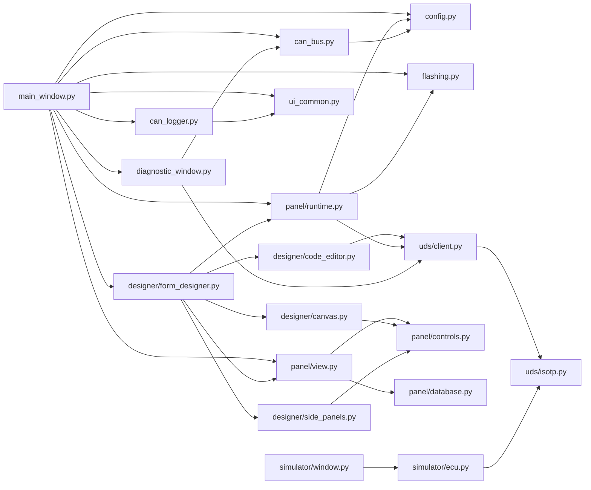
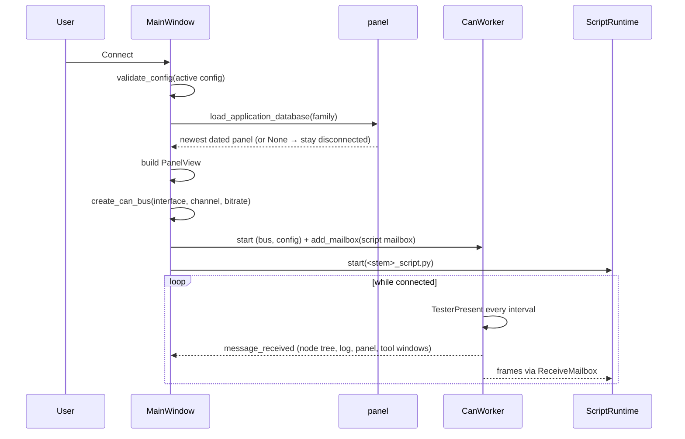
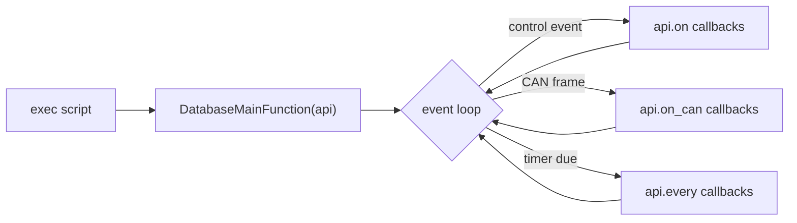
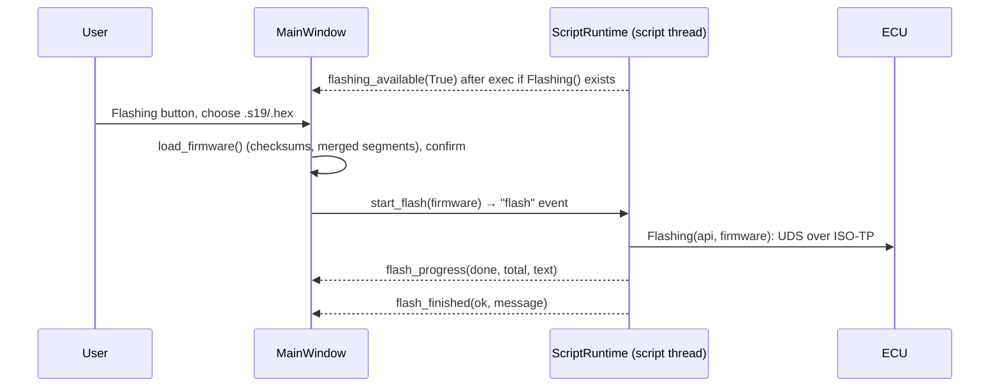

# CAN Expert – Developer Documentation

This document describes the architecture, threads and data flows of **CAN Expert** for developers who need to understand or extend the codebase. User-facing behaviour, the configuration schema and acceptance coverage are in [Requirements implementation](REQUIREMENTS_STATUS.md).

---

## 1. Overview

**CAN Expert** is a PyQt5 desktop application that:

- Connects to CAN hardware (**Kvaser**, **Vector**, **IXXAT**) via **python-can**
- Selects the newest dated **panel database** (`Databases/family_YYYY-MM-DD.xml`) for the active configuration and builds its UI before opening the adapter
- Sends periodic **TesterPresent** and shows responding ECUs beneath the selected receiver, marking lost nodes with a red cross
- Runs the panel's **Python script** (`DatabaseMainFunction(api)`) on a background thread with an API for CAN, UDS over ISO-TP, DLL calls and UI values
- Provides a **Form Designer**, a DBC-aware **CAN Logger**, and an ODX-driven **Diagnostic Window**

---

## 2. Module Map



| Module | Role |
|--------|------|
| **main_window.py** | Main window: configuration list, receiver/node tree, Connect/Disconnect, the ECU check that keeps node status live after Disconnect, Flashing button and progress, tool windows, CAN and debug logs, theme. |
| **can_bus.py** | `open_channel()`/`create_can_bus()`, `CanWorker` (the session's only bus reader, which also sends TesterPresent), `ReceiveMailbox` (bus facade for code off the GUI thread), `ChannelActivityScanner`. |
| **config.py** | Configuration defaults, `validate_config()`, `diagnostic_request_id()`/`uds_transport()` (the IDs and timing a configuration implies), `read_configurations()`/`save_configuration()`, and `ConfigurationDialog`. |
| **paths.py** | The data folders (`Configurations/`, `Databases/`, `DBC/`, `ODX/`, `examples/`), next to `main.py` or next to a frozen executable. |
| **panel/database.py** | Panel database files: `select_database()` (newest dated file per family), XML → dict parsing (`parse_widget()`), `decode_value_from_can_data()`. |
| **panel/view.py** | `PanelView`: renders pages and controls, decodes raw and DBC-bound values, emits `control_changed(name, value)`. |
| **panel/controls.py** | Control registry shared by the designer and running panels: per control its palette entry, properties, construction, value display and input events; painted controls (gauge, LED, multi-state indicator, toggle switch, knob, 7-segment display, trend); `format_value()` and appearance handling. |
| **panel/runtime.py** | `DatabaseAPI` given to scripts (`api.on/on_can/every`, `api.signal/set_signal/send_message`, `api.can`, `api.uds`, `api.dll`, `api.ui`, `api.log`, `api.progress`), `SCRIPT_TEMPLATE`, `ScriptRuntime` (script thread, handler functions, CAPL-style event decorators, timers, flashing, cancellation). |
| **uds/isotp.py** | ISO 15765-2 transport: single, first and consecutive frames, flow control (block size, STmin, WAIT, overflow) in both directions, the escape sequence beyond 4095 bytes. |
| **uds/client.py** | `uds_request()` (one exchange, skipping unrelated replies and extending the wait on NRC 0x78) and the ISO 14229-1 service functions for scripts (`RDBI`, `WDBI`, `DSC`, `SA`, `RC`, `RD`/`TD`/`RTE`, ... every service except 0x29 and 0x84) returning `UdsResult`; `NRC_NAMES`. |
| **flashing.py** | Firmware images: S-record/Intel HEX parsing (`load_firmware()`), and the dialogs shared by the main window and the designer's Test panel (choose a file, confirm with its address ranges, progress with Cancel, result). |
| **designer/form_designer.py** | The Form Designer dialog: pages, DBC path, save/load of XML + `_script.py`, handler stubs, the script editor tab and Test mode against the simulated ECU. |
| **designer/canvas.py** | The page canvas: widgets to move, resize, select and order, the drop target for palette items and DBC signals, layout tools, clipboard and undo/redo. |
| **designer/side_panels.py** | Control palette, DBC symbol list and the schema-driven property editor, with the designer's shared constants and naming helpers. |
| **designer/code_editor.py** | Python editor for panel scripts: syntax highlighting, line numbers, auto-indent, completion (API, control names, DBC signals, UDS functions), syntax check; `UdsFunctionPanel` lists the UDS functions by ISO 14229 functional unit and inserts calls. |
| **can_logger.py** | CANoe-style graphics window: DBC signal tree (filter, live values), one strip chart per ticked signal on a shared time axis, follow/pause/fit, Lock X / Lock Y for mouse zoom and pan, two measurement cursors with per-signal values and Δ, a dotted hover crosshair with a time/value readout, CSV export of all decoded data. |
| **diagnostic_window.py** | Loads ODX/PDX/CDD, builds request forms, runs UDS exchanges on a background thread, monitors the ECU's CAN IDs. |
| **simulator/ecu.py** | The simulated UDS ECU (sessions, security, DIDs, DTCs, flashing with RequestDownload/RequestUpload, ISO-TP flow control, periodic frames) for Kvaser virtual channels or any python-can interface. `EcuConfig` holds every setting and is read for each frame, so changes apply while running; `load_profile()`/`save_profile()` store it as JSON; `main()` opens the window, or runs headless with `--console`. |
| **simulator/window.py** | Dummy ECU window: connection (interface, channel detection, bit rate, Connect/Disconnect with the one-ECU-per-channel lock), settings tabs (addressing, flow control, UDS timing and security, flashing, periodic frames) applied live and remembered in QSettings, ECU status, log with an optional frame trace, JSON profiles. |
| **ui_common.py** | Shared Qt helpers: `app_settings()` (persistent QSettings, migrating the legacy `EZCan2/KvaserCAN` store once), `toolbar_icon()`, `CaptionButton`, `SplitterPanel` and `DockTitleBar`. |

---

## 3. Files and Folders


CanExpert/
├── main.py                     # Start CAN Expert
├── dummy_ecu.py                # Start the Dummy ECU (window, or --console)
├── canexpert/
│   ├── main_window.py          # Main window: configurations, receivers and ECU nodes, Connect, Flashing
│   ├── can_bus.py              # Opening a bus, CanWorker (reader + TesterPresent), mailbox, activity scan
│   ├── config.py               # Configuration defaults, validation, UDS transport, files, dialog
│   ├── paths.py                # Where the data folders are (also next to a frozen executable)
│   ├── flashing.py             # S-record / Intel HEX files and the flashing dialogs
│   ├── can_logger.py           # CAN Logger: CANoe-style graphs, one strip per signal
│   ├── diagnostic_window.py    # ODX Diagnostic Window
│   ├── ui_common.py            # Settings, toolbar icons, caption buttons, dock and splitter panels
│   ├── panel/                  # database.py (files), view.py (running panel), controls.py, runtime.py
│   ├── designer/               # form_designer.py, canvas.py, side_panels.py, code_editor.py
│   ├── uds/                    # isotp.py (ISO 15765-2), client.py (requests + ISO 14229 functions)
│   └── simulator/              # ecu.py (the simulated ECU), window.py (its window)
├── Configurations/             # config_<name>.json, one per configuration
├── Databases/                  # <family>_<YYYY-MM-DD>.xml and matching _script.py
├── DBC/, ODX/                  # Default folders for DBC and ODX/PDX files
├── examples/                   # Runnable panel + script pair, demo firmware
├── docs/                       # DOCUMENTATION.md, REQUIREMENTS_STATUS.md, Requirements.docx
├── tests/                      # Hardware-free acceptance, UDS and UI tests
└── requirements.txt
```

---

## 4. Connect Flow



Any failure before or during start-up calls `on_disconnect_clicked()`, which leaves Connect available. A `session_generation` counter discards signals from a previous session.

---

## 5. Threads and the Receive Path

`CanWorker` is the **only** reader of the hardware bus. Every received data frame is:

1. emitted to the GUI thread (`message_received`) for the node tree, CAN log, panel decoding, CAN Logger and Diagnostic Window, and
2. pushed into each registered `ReceiveMailbox` (`CanWorker.add_mailbox`).

A mailbox acts as a bus for code running off the GUI thread: `send()` goes straight to the adapter, `recv()` reads the mailbox queue. The panel script owns one mailbox for the whole session; each Diagnostic Window request registers a private mailbox for the duration of its exchange, so the two never compete for replies.

**UDS exchanges** (`uds.client.uds_request`):

- flush the mailbox first, so a reply queued before the request cannot answer it;
- run inside `mailbox.transaction()`; while any mailbox is in a transaction `CanWorker` defers its TesterPresent, because a single frame interleaved with a multi-frame request would abort it on the ECU;
- send the request as ISO-TP (ISO 15765-2): a single frame, or a first frame and consecutive frames paced by the ECU's flow control. A new ContinueToSend is awaited after every block of BS frames, and consecutive frames are at least STmin apart (timed with `perf_counter`, since `time.sleep()` can overshoot a 1 ms STmin by ~15 ms on Windows). WAIT restarts the N_Bs timeout (1 s, at most 16 WAITs), and overflow, an invalid flow status or no flow control abort with `IsoTpError`;
- receive the reply, answering a first frame with flow control (BS 0, STmin 0: the whole reply at once); a first frame that announces a length a single frame could carry is ignored, a new single or first frame replaces an unfinished message, and a wrong sequence number or more than N_Cr (1 s) between consecutive frames aborts;
- messages longer than 4095 bytes use the ISO 15765-2:2016 escape sequence (first-frame length 0, then 32 bits) in both directions;
- skip unrelated replies (e.g. TesterPresent) and extend the wait on NRC 0x78 (response pending).

Identifier size (11/29-bit) and the optional extended-address byte come from the configuration and apply to every frame.

---

## 6. Panel Scripts

`ScriptRuntime.start()` compiles `<stem>_script.py` and runs it on a daemon thread:



- Callbacks run serially; exceptions are logged and do not stop the loop.
- `api.ui.set_value()` emits `value_changed`, handled on the GUI thread by `PanelView.set_value()`.
- Disconnect sets the stop event (a `sys.settrace` hook raises inside Python code), closes the mailbox and revokes the script's bus. Blocking native calls cannot be interrupted.

Script API summary (see [Requirements implementation](REQUIREMENTS_STATUS.md#panel-scripts) for details):

| Call | Purpose |
|------|---------|
| `api.on(name, cb)`, `api.on_can(cb)`, `api.every(s, cb)` | Register callbacks |
| `api.can.send(id, data)`, `api.can.get_latest_messages()` | Raw CAN |
| `api.uds.request(payload)` | Any UDS request; returns positive or negative reply, or `None` |
| `api.uds.tester_present()`, `api.uds.rdbi(did)` | Common services (`rdbi` returns the data record without the DID echo) |
| `api.uds.request_download(fmt, addr, size)`, `api.uds.transfer_data(seq, data)`, `api.uds.request_transfer_exit()`, `api.uds.transfer_data_from_file(path, packet_size)` | Flashing |
| `api.progress(done, total, message)`, `api.flash_cancelled` | Flashing progress and cancellation |
| `api.dll.load(path)`, `api.dll.call(path, name, *args)` | Native libraries |
| `api.ui.get_value(name)`, `api.ui.set_value(name, value)`, `api.log(text)` | UI and logging |

UDS calls use the configuration's request/response IDs and its **UDS response timeout** (`timeout_ms`) unless a timeout is passed.

---

## 7. Firmware Flashing



The button is visible only while connected and enabled only when the script defines `Flashing`. Flashing runs on the script thread, so other script callbacks wait until it finishes. Cancel sets `api.flash_cancelled`; disconnecting stops the script. The TesterPresent heartbeat keeps running between requests, which keeps the programming session alive. See [Firmware flashing](REQUIREMENTS_STATUS.md#firmware-flashing) for the sample ISO 14229 sequence.

---

## 8. Panel Database Format

```xml
<application_database name="engine" dbc_path="../DBC/engine.dbc">
  <description>...</description>
  <pages>
    <page name="Main">
      <button label="Start" binding_value="start" x="10" y="10"/>
      <value label="Status" binding_value="status" x="10" y="50"/>
      <value label="RPM" binding_type="dbc" binding_value="EngineData.RPM" x="10" y="90"/>
      <slider label="Fan" can_id="0x202" byte="0" min="0" max="100" x="10" y="130"/>
    </page>
  </pages>
</application_database>
```

Control types (see `panel.controls.CONTROLS`): `button`, `switch`, `checkbox`, `radio`, `combo`, `slider`, `knob`, `spin`, `io_box`, `text_input`, `value`, `display`, `gauge`, `progress_bar`, `led`, `indicator`, `trend`, `output`, `label`, `group_box`, `picture`. Controls may be driven by a script binding, a DBC `Message.Signal` binding (the panel takes the signal's unit and value table), or legacy raw `can_id`/byte/bit mappings. A `handler` attribute names the script function an input calls. Element order within a page is the z-order. `panel.database.parse_widget()` parses the common attributes; control-specific attributes are kept as-is and interpreted by `panel.controls`.

---

## 9. Settings

`ui_common.app_settings()` returns `QSettings("CanExpert", "CanExpert")`. On first use it copies any keys saved under the previous `EZCan2/KvaserCAN` name, so existing theme and last-configuration choices survive the rename.

---

## 10. Testing

```
python -B -m unittest discover -s tests -v
```

- `tests/test_requirements.py`: end-to-end sessions over python-can's virtual interface (configuration restore, heartbeat, node loss/recovery, the ECU check after Disconnect, database selection, scripts, designer round-trip, multi-frame Diagnostic Window exchange, Flashing button).
- `tests/test_uds_services.py`: ISO-TP flow control frame by frame (block size and STmin, WAIT, overflow, invalid flow status, N_Bs timeout, flow control after every received block, unexpected and invalid frames, the escape sequence), ISO-TP and UDS against a simulated ECU (stale-frame flush, multi-frame requests/replies, response pending, 29-bit IDs with address byte, RequestDownload encoding, heartbeat deferral flag), S-record/Intel HEX parsing, and the example `Flashing()` against a simulated bootloader.

- `tests/test_dummy_ecu.py`: the simulated ECU's session, security, functional addressing, S3 timeout, DTC, flow control (WAIT, block size, STmin, overflow) and flashing behaviour, and its settings: RequestDownload formats, memory ranges, block length and full blocks, RequestUpload read-back, security level/seed/mask, P2/P2* and response pending on a slow response.
- `tests/test_dummy_ecu_window.py`: the Dummy ECU window connecting and disconnecting on a virtual bus (channel lock included), settings applied while connected, invalid text fields not applied, the log and frame trace, profiles and remembered settings.

No hardware is contacted. For a manual end-to-end check, run `python dummy_ecu.py`, connect it to Kvaser virtual channel 1, and connect CAN Expert to Kvaser virtual channel 0. Adapter drivers, bus electrical conditions and ECU timing still need a hardware acceptance run.
