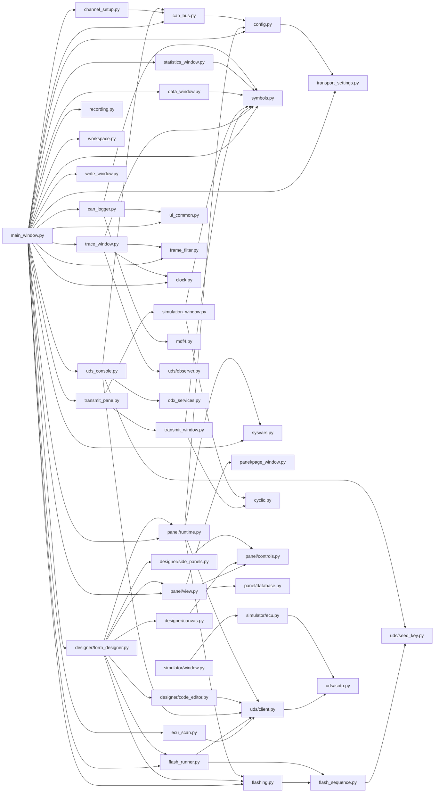
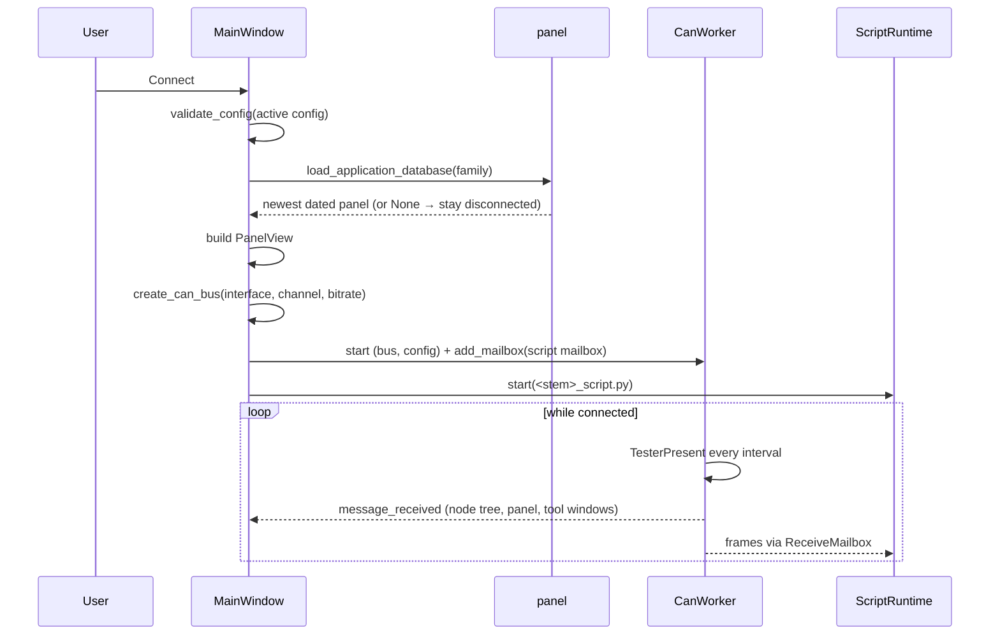
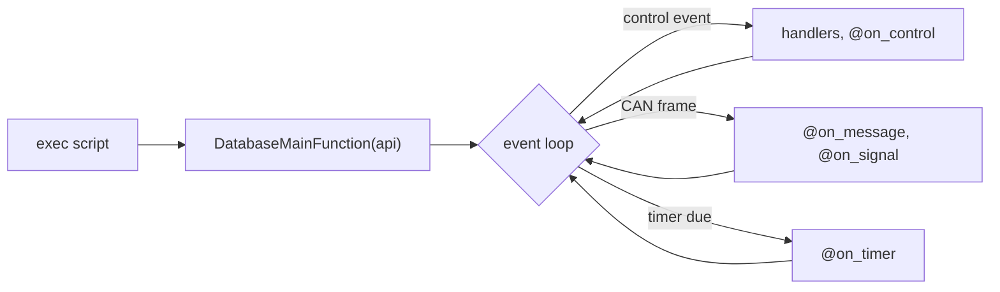

# CAN Expert – Developer Documentation

This document describes the architecture, threads and data flows of **CAN Expert** for developers who need to understand or extend the codebase. User-facing behaviour, the configuration schema and acceptance coverage are in [Requirements implementation](REQUIREMENTS_STATUS.md).

---

## 1. Overview

**CAN Expert** is a PyQt5 desktop application that:

- Connects to CAN hardware (**Kvaser**, **Vector**, **IXXAT**) via **python-can**
- Distributes every frame of the session - received, sent, or replayed from a file - to the tool windows and to an optional recording
- Selects the newest dated **panel database** (`Databases/family_YYYY-MM-DD.xml`) for the active configuration and builds its UI before opening the adapter
- Sends periodic **TesterPresent** and shows responding ECUs beneath the selected receiver, marking lost nodes with a red cross
- Runs the panel's **Python script** (`DatabaseMainFunction(api)`) on a background thread with an API for CAN, UDS over ISO-TP, DLL calls and UI values
- Provides a symbolic **Trace window**, a DBC-aware **CAN Logger**, a **Transmit** window (message list and simulated nodes), a **UDS Console** (every ISO 14229 service, ODX services, fault memory) and a **Form Designer**; the analysis windows and the panel live in a **workspace** where they tab, split and float, and the arrangement is saved
- **Records** the measurement to BLF/ASC/CSV and **replays** a recorded file back into those windows offline

---

## 2. Module Map



| Module | Role |
|--------|------|
| **main_window.py** | Main window: `MainWindow` builds the toolbar, the docks, the menus and the status strip, and keeps the configurations, recording and replay, the Flashing button with both ways of flashing and their progress, the loaded database's panel, help, the About box and the theme. The rest of it comes from four mixins, one module each, which only use what `MainWindow` sets up; what the tests redirect - the settings (`app_settings`) and the database folder - is looked up in `main_window.py`, the mixins reading `self._settings` and `self.databases_dir`. |
| **main_tools.py** | `ToolWindows`: each tool window's pane, opened on demand and filled with what came before (`open_tool()`, `open_trace()`, `open_uds_console()`, `open_tests()`...), the Form Designer, and the keys handed to the panel script. |
| **main_layouts.py** | `Layouts`: the arrangement saved on close and restored at the start, named desktops, Reset layout, and the panes put right after a saved state is applied (`LAYOUT_*`, `DESKTOPS`, `TOOL_AREAS`). |
| **main_channels.py** | `Channels`: the CAN Channels tree (receivers, the channels used before in bold, the ECUs answering and the database each can load), the ECU check that keeps node status live after Disconnect, the ECU scan and the channel setup. |
| **main_session.py** | `Session`: Connect/Disconnect and `dispatch_frame()`, the one path every frame takes - history, recording, then the `on_frame()` of every open tool window - with the panel, the script, the status strip and the unsolicited responses. `insert_marker()` (Ctrl+M), `quick_marker()` and `add_marker()` - the one path of a marker, also from `api.marker()` and `t.marker()` - into `marker_history`, the recording, every window's `on_marker()` and the Log. |
| **can_bus.py** | `open_channel()`/`create_can_bus()`, `CanWorker` (the session's only bus reader, which also sends TesterPresent), `ReceiveMailbox` (bus facade for code off the GUI thread). With `unsolicited=True` (the session's worker, unless the channel is listen-only) the worker emits `unsolicited(time, payload)` for the diagnostic responses no request waits for: between exchanges its `UnsolicitedAssembler` puts the response ID's frames together and answers a first frame with the session's flow control; during an exchange the mailbox's `uds_request()` hands over the replies that are not its answer, and when the exchange ends the mailbox hands back the frames it left unread (`push()` tells the worker whether an exchange was running, under the same lock as the count, so no frame is read twice or by no one). The answers to the session's own TesterPresent are not reported (`is_tester_present_answer()`). |
| **config.py** | Configuration defaults, `validate_config()`, `diagnostic_request_id()`/`uds_transport()` (the IDs, timing, padding and flow control a session's configuration implies), `read_configurations()`/`save_configuration()`, and `ConfigurationDialog` (any bit rate; its ISO-TP group is saved to the settings, not the file). |
| **transport_settings.py** | ISO-TP per configuration name, kept in the settings: `TransportSettings` (padding on with `0xCC` by default, the block size and STmin the tester asks for), `apply_transport()` folding them into a session's configuration as `isotp_*` keys, `TransportGroup` for the dialog. A configuration without the keys behaves as before. |
| **channel_setup.py** | Per adapter channel, kept in the settings: `ChannelSetup` (sample point, SJW, listen-only, receive filter), `bit_timing()` (a python-can `BitTiming` on the driver's clock), `parse_filters()`/`range_masks()` (identifier ranges cut into aligned id/mask pairs), `open_configured()` (options, filters with the session's response IDs added, `ListenOnlyBus`), `detect_bitrate()` (listen-only at each common rate). `channel_setup_dialog.py` is the dialog and its `BitrateDetector` thread. |
| **frame_filter.py** | The Trace's filter syntax: `parse_filter()` and `FrameFilter` (ranges, names, Pass/Stop, direction). |
| **clock.py** | `MeasurementClock` (the start of the measurement, set at connect, ECU check or replay) and `absolute_text()` (a time of day, or seconds when the timestamp is not one), so every window shows a frame's own time against the same start. |
| **features.py** | Features built but switched off for now - CAN Expert's `#if 0`. A feature that is off shows nowhere (toolbar, menus, windows, the script API, completion, the user manual); its code stays and its tests switch it on. Read while the application runs, so a test can patch it. Now: `SYSTEM_VARIABLES = False`. |
| **sysvars.py** | System variables, **switched off** (`features.SYSTEM_VARIABLES`): `SystemVariables` (thread-safe values, definitions in the settings or a JSON file, `changed` signal, reset at each measurement) and `SystemVariablesWindow`. Switched on, the main window has a System Variables window and feeds the CAN Logger, and scripts get `api.sysvar` and `@on_sysvar`. |
| **write_window.py** | The Write window: the script's output with its level and time (Absolute or Relative, as *View → Time display* says), level filter, search, save; and `watch_values()` for the Script variables tab. |
| **ecu_scan.py** | `find_responders()` (TesterPresent over an 11-bit range or 29-bit normal fixed addresses), `probe()` (sessions, identification DIDs), `EcuScanner` (a thread; over a session mailbox it holds a transaction so the session's TesterPresent pauses) and `EcuScanDialog`. |
| **mdf4.py** | `write_mdf4()`: a dependency-free ASAM MDF 4.10 writer (a data group with a master time channel per signal, units, the start time). |
| **paths.py** | The data folders (`Configurations/`, `Databases/`, `DBC/`, `ODX/`, `examples/`), next to `main.py` or next to a frozen executable. |
| **panel/database.py** | Panel database files: `select_database()` (newest dated file per family), `split_database_id()` (family and date of a file stem, read the same way), XML → dict parsing (`parse_widget()`), `decode_value_from_can_data()`. |
| **panel/view.py** | `PanelView`: builds every page as a `PanelWindow` - in tabs, or handed out as `page_windows` for the main window to make each one a workspace window - decodes raw and DBC-bound values, emits `control_changed(name, value)`. |
| **panel/page_window.py** | `PanelPage` (controls at their designed geometry and font, drawn at a zoom factor) and `PanelWindow` (Fit or 50-200 %, Ctrl + wheel). |
| **panel/controls.py** | Control registry shared by the designer and running panels: per control its palette entry, properties, construction, value display and input events; painted controls (gauge, LED, multi-state indicator, toggle switch, knob, 7-segment display, trend); `format_value()` and appearance handling. |
| **panel/runtime.py** | `DatabaseAPI` given to scripts (`api.signal/set_signal/send_message`, `api.can.send`, `api.dll`, `api.ui`, `api.log/write/warn`, `api.progress`, and `api.sysvar` when system variables are switched on; the deprecated `api.on/on_can/every`, `api.can.get_latest_messages` and `api.uds.*` still work), `SCRIPT_TEMPLATE`, `ScriptRuntime` (script thread, handler functions, CAPL-style event decorators - `on_start/stop/timer/message/signal/control/key/error_frame/bus_state/periodic_data/response_event`, and `on_sysvar` when switched on - timers, flashing, cancellation; `message(level, text)` for the Write window). `j1939` (a `J1939Link` on the script's mailbox, from the J1939 window's address) and `@on_pgn`, fed by a `J1939Assembler`. |
| **uds/isotp.py** | ISO 15765-2 transport: single, first and consecutive frames, flow control (block size, STmin, WAIT, overflow) in both directions, the escape sequence beyond 4095 bytes. |
| **uds/client.py** | `uds_request()` (one exchange: unrelated replies - periodic `6A <id> <data>` frames too, while it waits for the answer to 0x2A - are skipped and handed to `bus.unsolicited` where the bus has it; NRC 0x78 extends the wait; NRC 0x21 sends the request again, `BUSY_RETRIES` times at most, `BUSY_RETRY_DELAY` apart), `unsolicited_kind()` (periodic data or an event's response, and for which identifier or service), `make_request()` (a request function bound to one mailbox, for the console and its ODX tab, the flash runner and the scan) and the ISO 14229-1 service functions for scripts (`RDBI`, `WDBI`, `DSC`, `SA`, `RC`, `RD`/`TD`/`RTE`, ... every service; `AUTH` and `SDT` take their records as bytes) returning `UdsResult`; `NRC_NAMES`. `DSC()` learns the P2/P2* the ECU announces and every later request waits that long, never less than the configuration allows. |
| **uds/observer.py** | Reading diagnostics out of plain frames: `assemble()` puts ISO 15765-2 single, first and consecutive frames back together into `TransportMessage`s (escape sequence and extended addressing included, flow control dropped), and `service_name()` names the service from the catalogue in `uds/client.py`. |
| **uds/seed_key.py** | SecurityAccess keys: `xor_key()` for the mask rule, and `load_library()`/`generate_key()`/`dll_key()` for a real ECU's `GenerateKeyEx` DLL (the Vector ABI), with `SeedKeyError` saying what a DLL refused before anything is sent. |
| **flashing.py** | Firmware images: S-record/Intel HEX parsing (`load_firmware()`), and the dialogs shared by the main window and the designer's Test panel - choose a file, `FlashDialog` (which way to flash, with the address ranges), `FlashProfileDialog` (every setting of the built-in sequence, saved and loaded as JSON), progress with Cancel, result. |
| **flash_sequence.py** | Flashing without a panel script: `FlashProfile` (what differs between bootloaders, down to sending `image_crc()` - the CRC-32 of the segments in address order - as the dependency check's option record), `run_flash()` (the ISO 14229 sequence itself), `FlashRun` (the steps taken and the report file). No Qt, so it can be tested on its own. |
| **flash_runner.py** | `FlashRunner`: `run_flash()` on a thread with its own `ReceiveMailbox` on the running measurement, reporting through `progress`, `logged` and `finished` signals - the shape the panel script's flashing already reports through - and writing the report when it ends, either way. |
| **designer/form_designer.py** | The Form Designer dialog: a menu bar (File, Edit - acting on the form or on the focused text or script, `_edit_target()` - Arrange, Page, Script, Test, Help; the Edit keys are scoped to the canvas so text fields keep their own), the Form, Python script and Database tabs (identity with a live hint from `split_database_id()`, DBC, contents, the configurations using the family), save/load of XML + `_script.py`, unsaved changes in the title and a Save/Discard/Cancel question before they are dropped - only for a window on screen - handler stubs, and Test mode against the simulated ECU. `TestPanelDialog` flashes through the main window's `FlashDialog` - the script's `Flashing()` or the built-in sequence via `FlashRunner`, for which it offers `add_mailbox`/`remove_mailbox`/`message_sent` as a session's worker does. |
| **designer/canvas.py** | The page canvas: widgets to move, resize, select and order, the drop target for palette items and DBC signals, layout tools, clipboard and undo/redo. |
| **designer/side_panels.py** | Control palette, DBC symbol list and the schema-driven property editor, with the designer's shared constants and naming helpers. |
| **designer/code_editor.py** | Python editor for panel scripts: syntax highlighting, line numbers, auto-indent, completion (the current API without the deprecated calls, control names, DBC signals, UDS functions), syntax check; `UdsFunctionPanel` lists the UDS functions by ISO 14229 functional unit and inserts calls. |
| **can_logger.py** | CANoe-style graphics window: DBC signal tree (filter, a System variables branch while they are switched on; the current values are the Data window's), samples capped per signal (`_Series` drops its oldest quarter), one strip chart per ticked signal on a shared time axis or several signals in one graph with a legend (`graph_groups()`/`set_graph_group()`), statistics between the cursors, `export()` as long or wide CSV, MDF 4 or PNG, a symbol toolbar (clear, pause/resume, follow, fit, Lock X / Lock Y for mouse zoom and pan, measurement cursors) whose icons follow the theme, two white dashed measurement cursors labelled #1 and #2 with per-signal values and Δ, a dotted hover crosshair with a time/value readout, Graph options (drawing style: step line, line with dots or dots; follow window; exact time and value ranges), CSV export of all decoded data. `on_marker()` draws a dashed line across every graph, the comment on the top one; the lines are drawn again when the graphs are rebuilt and go with `clear_data()`. J1939 DBC messages are decoded from any source address (`_pgn_decoders`). |
| **trace_window.py** | The Trace: frames buffered and flushed to a tree on a timer, symbolic names and lazily decoded signals from `symbols.py`, absolute/relative/delta time, pass and stop filters (`parse_filter()`), find, colour per identifier, CSV export; at most `MAX_ROWS` frames. **Transport** rebuilds the view from `uds/observer.py`, a row per diagnostic message instead of per frame. Markers (`add_marker()`, the main window's `on_marker()`) are kept apart from the frames and merged into the rows by time, in both views, whatever the filter. The J1939 button names 29-bit frames with `j1939.pgn.describe()`, lets the filter take PGN names, and adds the transport protocol's messages (`j1939_messages()`) to the transport view. |
| **statistics_window.py** | `Statistics`: frames per identifier with their rate, average/min/max cycle time and share of the bus (`frame_bits()` counts the overhead and worst-case stuffing), plus error frames and the controller state; `StatisticsWindow` shows them with freeze, filter, reset and CSV export (the bytes are the Trace's). Rates are measured against the newest frame while a file is replayed, so a recording keeps its own timing. |
| **data_window.py** | `SignalValues`: the newest value of every signal, physical and raw (`decode(..., scaling=False)`), with its unit, age and count; `DataWindow` lists them beside the signals of the databases that have not arrived. |
| **simulation_window.py** | Simulated nodes: a branch per `message.senders` entry with its messages, the data editable signal by signal, sent at their cycle times by one timer through `CyclicSchedule`. What was ticked is remembered. The *Simulated nodes* tab of the Transmit window. |
| **cyclic.py** | `CyclicSchedule`: when each key of a set is next due. Shared by the transmit list and the simulated nodes so the drift arithmetic - due at `t + cycle`, not "now + cycle", without queueing up a backlog after a long gap - lives in one place. |
| **transmit_window.py** | The transmit list: rows (raw or bound to a database message) in a table, `tick()` sends the ones whose cycle time has come, `SignalEditor` re-encodes a message signal by signal, rows stored as JSON in the settings or a file. A row that fails to send switches itself off. The *Messages* tab of the Transmit window. |
| **transmit_pane.py** | `TransmitPane`: the Transmit window, the transmit list and the simulated nodes as two tabs. Both pages are built with `stop_when_hidden=False`, so they keep sending behind another tab; the main window calls `stop_sending()` when the pane is closed. `open_transmit(nodes=True)` brings the nodes tab to the front. |
| **testing/runner.py** | Test modules: `load_module()` reads a file's `@testcase` functions in order and its `setup`/`teardown`/`before_each`/`after_each` hooks (the title is the docstring's first line); `Runner` runs the chosen cases on the calling thread with the UDS functions bound to a request function, giving each a `TestContext` (`check`, `check_equal`, `check_range`, `expect_nrc`, `require`, `fail`, `skip`, `block`, `warn`, `log`, `wait`, `send`, `wait_for_frame`, `wait_for_signal`) and returning a `TestReport` of `CaseResult`s with their `Step`s. A failed `require` ends a case, an exception makes it an *error*, `block()` (in `before_each`) makes it *blocked* - not run, counted with the failures - `warn()` is a step that does not fail it, a failed setup skips every case; `accept(case name, step description)` turns a failed step it knows into an *accepted* one; `stop()` skips the rest, while `after_each` and `teardown` still run. `FrameMailbox` stamps each frame with its arrival, so a wait takes what came after it began or after the test's last send. `call_hook(function, t)` runs a hook with another case's context and returns its verdict (TestExpert runs modules among its tests that way); inside `t.lenient()` failed steps are recorded as warnings (`require()` still ends what it is in). |
| **testing/report.py** | `html_report()` (one self-contained page: verdict, counts, facts - and more given by the caller - each case's steps, the ones that did not pass or have warnings or accepted deviations opened, and sections given by the caller), `summary_text()`, `junit_report()` (one testsuite; failed setup/teardown become testcases so CI shows why everything was skipped; a blocked case is an error of type Blocked) and `save_reports()` (`<module>_<date-time>.html/.xml`). |
| **testing/window.py** | The Test window (a tool pane): open/reload a module (the last one is remembered, else `TestModules/dummy_ecu_checks.py`), tick cases, run them on a thread over two mailboxes of the session's worker (requests, and a `FrameMailbox` for the waits), the steps live in the tree and the log, Stop, and the reports saved to `reports/` beside the module. |
| **j1939/pgn.py** | J1939 identifiers: `parse_id()`/`make_id()` (priority, PGN, source, destination; PDU1 with its destination in the PS byte, PDU2 to everyone), the PGNs CAN Expert uses, `PGN_NAMES` and `pgn_name()`, `describe()` for the Trace, `dbc_pgn()` and `lookup()` for the symbol databases. No Qt. |
| **j1939/name.py** | The 64-bit NAME: `Name` with its fields, `to_int()`/`from_int()`, little-endian `to_bytes()`/`from_bytes()`, the functions and industry groups by name. |
| **j1939/dm.py** | DM1/DM2: `parse_dm()`/`build_dm()` (lamps and their flash state, then SPN, FMI, conversion method and occurrences, four bytes a DTC), `J1939Dtc.text()` with FMI texts and common SPN names. |
| **j1939/transport.py** | The transport protocol: `J1939Assembler` (frames in, messages out: BAM and RTS/CTS sessions whole, unfinished when aborted, a packet is lost or T2 passes, `finish()` at the end), `J1939Link` on a bus facade (`send()`: one frame, a BAM with 50 ms between packets, or an RTS/CTS session following the receiver's CTS; `request()`: a Request, then the answer in one frame, a BAM, or an RTS/CTS session it answers with CTS and EndOfMsgAck, or a NACK; `send_request()`, `acknowledge()`). |
| **j1939_window.py** | The J1939 window (a tool pane): its address (`ADDRESS_SETTING`, `address_setting()`), the nodes from Address Claimed, each node's DM1 faults (DM2 on request, DM11/DM3 clear), and any PGN requested or sent - over its own mailbox of the session's worker, on a background thread; `explain()` reads SOFT/VI/CI text, faults, a NAME, or signals from the symbol databases. |
| **status_strip.py** | The main window's status strip: `DiagnosticState` reads the session (50, 51) and security (67 with an even sub-function) and the last NRC off the ECU's single-frame answers as they pass, so it holds whoever sent the request; `StatusStrip` shows Bus / Session / Security / Last error, the error being a link to the Log. |
| **about.py** | The About box: `versions()` - CAN Expert, Python, Qt and PyQt5, the libraries from their metadata (the spec copies it into the Windows build; a module's `__version__` otherwise) and the Kvaser, Vector and IXXAT driver DLLs' version resources (`driver_version()`, without loading them) - and **Copy** for a bug report. |
| **uds_console.py** | The UDS console: a service tree built from `uds.client.FUNCTIONS`, a request form generated from each function's signature (`_field()`/`_arguments()`), exchanges on a background thread over a private mailbox (`uds.client.make_request()`), the ODX tab (`odx_services.OdxTab`) whose requests go through the same exchange and whose layer decodes every answer once a file is loaded, log lines with the measurement time, the session/security bar with the state strip (session, the P2/P2* the ECU asked for, lock state) and the key source (mask or seed & key DLL), a fault-memory tab (`status_text()` spells out the DTC status bits), and the Periodic & events tab (0x2A start/stop, ResponseOnEvent set-up and control, and `on_unsolicited()`, which the main window calls for every response the worker reports, counting it per periodic identifier or event service). |
| **recording.py** | `Recorder` (python-can writers, format by file name), `read_frames()`, `ReplayWorker` (a thread that hands frames back at their recorded spacing) and `ReplayDialog`. `Recorder.write_marker()` puts a marker in the file where the format holds one: a BLF global marker, an ASC or TRC comment line. |
| **workspace.py** | The central workspace: the Qt Advanced Docking System (PyQtAds) configured for CAN Expert (`create_workspace()`), the windows put into it (`make_pane()`, `add_pane()`, `set_content()` for a window made before its content), `pane_names()` - the windows a saved state places - and what a restored state needs put right: `put_back()` for a window it did not know, `drop_empty_floating()`, `fit_on_screen()` for a floating window too small or off every screen. On Linux without X11 (Wayland, or headless as in CI) it removes PyQtAds' filter on the main window, which sends X11 messages without checking for X11 and crashed when the window closed with a pane floating. |
| **symbols.py** | `SymbolDatabases`: the DBC files the application shares (paths in the settings), frame id → message, `decode()`, `signal_names()`, `unit()`, and the dialog that edits the list. A file that cannot be read lands in `errors` without failing the others. A message defined as a J1939 parameter group (cantools `protocol == "j1939"`) also matches every frame of its PGN, whatever its source address (`j1939.pgn.lookup()`). |
| **odx_services.py** | ODX with odxtools: `load_database()` (ODX/PDX/CDD), `first_layer()`, `services()`, `decoded()` (a reply decoded by the service that asked, or by the layer), `dtc_texts()` (trouble code -> display code and text from the layer's DTC-DOPs, inherited ones included) with `dtc_text()` (also found without the failure type byte, for files listing 2-byte codes) and `dtc_display()` (the SAE J2012 form, `P0101-00`), and `OdxTab`, the console tab that lists a layer's services and builds their request forms; `layer_changed` tells the fault memory tab to refresh its texts. |
| **simulator/ecu.py** | The simulated UDS ECU for Kvaser virtual channels or any python-can interface: sessions, security levels (mask or seed & key DLL, `security_levels()`), service rules (`service_rules()`), DID tables whose entries can follow a signal or need a session or a level (`data_tables()`), periodic data (0x2A, `_send_periodic()`), ResponseOnEvent (0x86, `_fire_events()`), I/O control (0x2F) over the signals, memory by address (0x23/0x3D, `write_memory()` merging segments), DIDs with the values they may be written with (0x31 for others), a processing delay beyond P2 answered after a response pending - which lifts the suppress bit -, RoutineControl with start, stop and results (the erase and check routines in the programming session, a self test in the extended one; 0x24 out of sequence, 0x31 in another session), flashing with a bootloader that takes over after a reset with an invalid application and an optional CRC-32 check, ISO-TP flow control, and transport errors on purpose (`_Mistaken`, `_chance()`). `tick()` does what the ECU does by itself - application frames, periodic data, events, the operation cycle timer, the S3 timeout - and `serve()` runs it with the receive loop. The channel lock goes by request ID, so several can share a channel. `EcuConfig` holds every setting and is read for each frame, so changes apply while running (`refresh()` takes changed tables and signals); `load_profile()`/`save_profile()` store it as JSON, `check_config()` refuses a broken one; `main()` opens the window, or runs headless with `--console`. |
| **simulator/signals.py** | The ECU's application traffic: `SignalSimulation` loads a DBC (`BUILTIN_DBC`, the same as `DBC/dummy_ecu.dbc`, or a file), gives each signal a generator (`GENERATORS`; `DEFAULT_GENERATORS` reproduce the ECU's usual 0x300/0x301 traffic), schedules each message at its period (`due_frames()`), keeps values within the signal's bits (`to_raw()`), and lets I/O control hold a signal (`override()`/`release()`). No Qt. |
| **simulator/dtc.py** | The ECU's fault memory: `DtcMemory` with status bytes following faults through operation cycles (pending, confirmed after `confirm_cycles`, aged out after `aging_cycles`), the snapshot captured and the occurrence counted when a fault appears, frozen by ControlDTCSetting, cleared by 0x14; every change is queued for ResponseOnEvent. `status_text()` names the bits. No Qt. |
| **test_expert/description.py** | TestExpert's model of an ECU's diagnostics: `EcuDescription` with `Session`s (and where each is entered from, `session_path()`), what it does not know (`unknown`: writing, sub-functions, starting routines), each DID's `DataField`s (position, bits, encoding, valid coded ranges, text table, scale, shift, unit; `coded()`, `encode()`, `check()`, `shown()`), security levels, `Service`s with their sub-functions, `DataIdentifier`s and `Routine`s, each with an `Access` (sessions, security levels); JSON; `build_description()` from `RawService`s - the constant bytes a request starts with, the states it may be executed in, the transitions it causes - and `RawState`s: sessions from DiagnosticSessionControl's transitions into session states, levels from SecurityAccess's into security states, a service needing a level when only unlocked states allow it. |
| **test_expert/cdd.py** | `load_cdd()`: CANdela documents - VAR / DIAGCLASS (tmplref: DCLTMPL) / DIAGINST / SERVICE (tmplref: DCLSRVTMPL) -> PROTOCOLSERVICE REQ, whose CONSTCOMP and STATICCOMP (the instance's STATICVALUE for the template's SHSTATIC) give the request's constant bytes; STATEGROUPS (spec session/security, else their name) numbered from 1 for mayBeExec and trans (a warning for documents without them); a DID's data record from its instance's data container - a SIMPLECOMPCONT whose SHPROXY is the data, not the response codes - walked through DATAOBJs, GAPDATAOBJs, STRUCTs and UNIONs (`record()`), each data object's type (CVALUETYPE bl/enc/qty, TEXTTBL's TEXTMAPs, LINCOMP's COMPs with factor, offset and divisor, PVALUETYPE's UNIT); a warning for KWP2000 documents; `cdd_variants()` and the VAR to read (the first by default; `CddError` for
one the file does not have). Checked against a real CANdelaStudio export (cantools' example.cdd). |
| **test_expert/odx.py** | `load_odx()` through odxtools (`coded_const_prefix()`, pre-condition states and state transitions matched by the states' ODX IDs, state charts by semantic, names without CANdelaStudio's _Read/_Write/_Start endings; `did_fields()` from a ReadDataByIdentifier's positive response: byte and bit position, coded type, TEXTTABLE or LINEAR compu method, internal limits, unit; a MIN-MAX-LENGTH-TYPE at the end as text of any length), the variant to read
(`variant_layers()`: the ECU variants, then the base variants), `identify_odx()` - odxtools' `VariantMatcher` on
the ECU-VARIANT-PATTERNs, with the cache off (it cannot hash the answers' bytearrays) - and `load_description()`
by extension. |
| **test_expert/dummy.py** | `dummy_description()`: the Dummy ECU's description from its settings (`SERVICE_SESSIONS`, `SUB_FUNCTIONS`, its DID tables with their names and fields - `did_fields()` - and its routines), as a CDD would describe it. |
| **test_expert/generator.py** | `Suite`: the generated test cases, grouped (sessions, TesterPresent, unsupported services, availability, NRC order, message length, sub-functions, DIDs, security access and lockout, routines, fault memory, communication, ECU reset, functional addressing, timing; the values of DIDs against their fields, writes at and beyond their limits, routines' stop and results before a start and the routines a plan allows started, S3, a response pending checked with every step), named `group.title` in slugs so a plan can name them, with steps `positive()`, `negative()` (a situation of the NRC policy: the codes it accepts pass, one ISO does not name with a note), `silent()`, `available()`, `enter()` (through the sessions a session must be entered from) and `unlock()`; every checking step counted in the run's `Coverage` (in the session the `Tester` says the request went out in), the ISO identification DIDs read in setup (`identification`); `module(names)` for `canexpert.testing.runner`, whose hooks run the sequences: before the run in `setup` (a failure fails it), before a group, every test and a test in `before_each` (a failure blocks the test; before a group, the whole group), after them in `after_each` and `teardown` (a failure is a warning), with the outcome conditions; `Options` (destructive, lockout, functional, key source, margins, S3, the routines to start - `parse_routine_starts()`, the transport layer's tests, the download and memory ranges). CAN Expert's test modules (`modules`) are groups after the generated ones, their cases named `module_<file>.<function>`: the module's setup in the `before_each` of its first case (a failure blocks the group), its `before_each`/`after_each` around each case (no default session between them), its teardown after the last - or in the run's teardown when the run stopped - with `t.lenient()`; their UDS functions and `j1939` bound to the tester in `setup`, their answers counted in the coverage with the case's verdict. |
| **test_expert/transport.py** | The transport layer's tests (ISO 15765-2), a group of the `Suite` (`Options.transport`): `Link` sends raw frames on the plan's identifiers with its addressing and padding and reads the ECU's (`flow_control()`, `continue_to_send()` through WAITs, `segments()`, `send_consecutive()` keeping to the ECU's block size and STmin, `answer()` through responses pending, `first_frame()`); `TransportTests` - the ECU receiving (a four-DID read, else a TesterPresent too long: flow control and answer, a wrong sequence number, a consecutive frame after N_Cr, a single frame in the middle, frames to ignore, a first frame of 4095 bytes) and, with a DID of 11 bytes or more, sending (block size 1, STmin 50 ms measured as the longer of the reader's clock and the frames' timestamps - `gap()` - WAIT, Overflow, a reserved flow status, no flow control). |
| **test_expert/services.py** | `ServiceTests`: services taken further than their availability - download and upload (out of order, locked, a wrong format; the plan's `download` started, then refused again and ended by the default session), memory by address (a wrong format; the plan's `memory` read, written while locked and written back), periodic data (a DID of F200-F2FF sent and stopped, watched through `transport.Link`), ResponseOnEvent (no event; an event on a DID found changing between two reads), CommunicationControl stopping the ECU's own frames (counted by identifier besides the diagnostic ones); `parse_memory_range()`. Their NRCs are situations of the NRC policy. |
| **test_expert/modules.py** | `load_modules()` (a `LoadedModule` keeps why a file could not be read), `BusFrames` - the frames a module's `wait_for_frame()` reads from the tester's bus, with their arrival taken from their timestamp when it is on this computer's clock - and `Symbols` (the plan's symbol databases through `canexpert.symbols`, for `decode()`). `modules_tab.py`: the Modules tab (the files, what each holds or why it was not read, the symbol databases). |
| **test_expert/variants.py** | Which variant an ECU is: `identify()` - an ODX file's own patterns, else the plan's `Identification` (a DID and each variant's expected value, as text or hex bytes); `is_odx()`. `variant_dialog.py`: the dialog giving that DID and those values. |
| **test_expert/plan.py** | `TestPlan`: the description (a path, relative to the plan's folder when it can be; "" for the Dummy ECU's), `Connection` (identifiers written as hex text), the `Options` values, `KeySource` (XOR mask or seed & key DLL), recording, the reports' folder, the tests left out and the sequences, the variant, whether to identify it
and the `Identification`, `check()` (a setting that cannot be read is a `PlanError`: the command line stops before
the bus is opened), the test modules and symbol databases (`module_paths()`, `symbol_paths()`; moved
with the plan), as JSON with a format marker and version; `load_description()`, `make_options()`, `resolve()`/`relative()`, `save()` (rewriting relative paths for a new folder), `is_plan_file()`. |
| **test_expert/engine.py** | `PlanRun`: one run of a plan on a bus or a CAN worker's mailbox - the suite (with the plan's NRC policy), the tester, the runner (with its accepted deviations) - with `run()`, `stop()`, `results()`, `save()` (the results as JSON beside the reports: the plan, the description, the NRC policy, the accepted deviations, the coverage summary and the ECU's identification in their facts, and the coverage section); `RecordingBus` records a bus's frames both ways for runs without the window. The plan's test modules are read when the run is made, and the runner gets `BusFrames` and the plan's symbols for them; the facts name the modules and symbol databases. |
| **test_expert/cli.py** | The command line: the window (a plan or a description to open), `--compare BEFORE AFTER` (the changes printed, `--output` for a page; exit code 1 when a test regressed), `--discover` (the plan's or the given ranges; the findings printed, the discovery's page and JSON, the found description with `--save-description`; exit code 0 when the ECU matches its description, 1 when not), or `--run` without it - the plan (or a description with the defaults) with the connection given on the command line, a Dummy ECU in the process with `--dummy-ecu`, `--variant` and `--identify` (`_identified()`: asked after
opening the bus, exit code 2 when it cannot be told), `--module` and `--symbols` (added to the plan's), the verdicts printed, the reports (and a copy of the JUnit XML with `--junit`), exit code 0/1/2; the frozen windowed program attaches to its parent's console. |
| **test_expert/discovery.py** | `Discovery`: asks the ECU through a `Tester`, session by session (entered by `EcuDescription.session_path()`), each service's SID alone (not 20 and 82, KWP's one-byte requests), the DIDs of `DiscoveryOptions`' ranges and the description, each routine's results (31 03) and each requestSeed 01-41; stops on request or when the ECU stops answering. `DiscoveryResult` (states per session, JSON, `to_description()` - services where they answered, 0x33 to the SID alone meaning a level, DIDs with their length, routines, levels, and `unknown` for what asking cannot tell), `compare()` - findings missing / undocumented / different - and `discovery_html()`/`discovery_page()`. |
| **test_expert/discovery_view.py** | The discovery's options dialog (sessions, ranges checked as typed, an estimate of the requests) and the Discovery tab (use as the description, save). |
| **test_expert/compare.py** | A run's results as JSON (`results_dict()`: facts, identification, each test and its steps, coverage), `load_results()`, `previous_results()` (the last run of the same description in a folder), `compare_runs()` - regressions, fixes, other verdict changes, new and gone tests, steps answering otherwise (matched by description and occurrence, times left out: `answer_of()`), identification changes - and `comparison_html()`/`comparison_page()`. |
| **test_expert/coverage.py** | `Coverage`: the steps' verdicts counted by (SID, session), (DID, session, read/write), (RID, session) and functional SID, as `Cell`s (JSON for the run's results); `untested()` - what the description has and no step checked, with the reason; `coverage_html()` - the report's and the Coverage tab's matrices; `summary()`. |
| **test_expert/policy.py** | `SITUATIONS` (each with the NRCs ISO 14229-1 allows there, the first the one it asks for), `NrcPolicy` (the NRCs that pass per situation where they differ from the defaults), `Deviation` (a test's failed step - or any, "*" - accepted, with a comment and a date) and `accept_function()` for the runner's `accept` hook. |
| **test_expert/policy_editor.py** | The Deviations tab: the NRC policy table (typed codes checked, changed ones marked, back to ISO) and the accepted deviations (comment editable, remove). |
| **test_expert/sequences.py** | Pre-test and post-test sequences: `SequenceStep` (request with its expected answer, wait, keep alive, session, unlock, ECU reset, CAN frame, Python function) with the parsers of its value, `Attachment` (before/after, run/group/test/every test, always/failed/passed), `Sequence`, the `PRESETS`, `due()` and `SequenceRunner`, which runs a sequence's steps as steps of the test case in the mode its place calls for. |
| **test_expert/sequence_editor.py** | The Sequences tab: the list (tick to run), the steps table (kind, value checked as it is typed, expected answer, functional) and the runs table (when, around, which group or test, condition); `attach()`/`detach()` for the tests tree's menu. |
| **test_expert/tester.py** | `Tester.ask()`/`quiet()`: a request, physical or functional, and the timed `Answer` (positive, NRC, text, the time to its first frame and to each response pending, busy repeats, a transport error); the session the ECU is in, followed from its answers; `send_frame()` for sequences. |
| **test_expert/window.py** | TestExpert's window: a toolbar of `QAction`s (`TOOLBAR`, the symbols of `ui_common.toolbar_icon()` in the theme's colours) shared by the menus and the ECU tab, each run compared with the last one of the same description (the Comparison tab, shown when something regressed; any two runs from the File menu), what it holds is a test plan (`plan()`, `apply_plan()`; new, open, save, save as; kept in the settings with absolute paths for the next start), the description (open, Dummy ECU, save as JSON; its variants: chosen, identified - on connecting too), the ECU connection (a CAN worker without TesterPresent, identifiers from a CAN Expert configuration), the settings, the sequences, the tests to tick (with the sequences around each, and a menu to attach them), the run on a thread with live verdicts, reports and an optional `.blf` recording in `TestExpert/reports`; `main()`. |
| **simulator/j1939_node.py** | The Dummy ECU as a J1939 node (`EcuConfig.j1939`): the address claim with its NAME (lost to a lower one), DM1 every second from the fault memory (`spn_fmi()`: P0101 SPN 132 FMI 2, U0100 SPN 639 FMI 9), its address put into the 29-bit application frames, answers to requests (Address Claimed, DM1, DM2, SOFT, VI, CI, the PGNs it broadcasts; DM11/DM3 clear with an ACK; a NACK otherwise), BAMs sent over several ticks so UDS keeps its timing. |
| **simulator/window.py** | Dummy ECU window: connection (interface, channel detection, bit rate, Connect/Disconnect with the one-ECU-per-channel lock), the settings applied live (`_read_config()`, `_apply()`) and remembered in QSettings (`saved_profile()`), the ECU's status, log with an optional frame trace, JSON profiles. Its tabs come from two mixins: |
| **simulator/window_pages.py** | `Pages`: the settings tabs - addressing, flow control, UDS timing and periodic data, access, flashing and the bootloader, signals, errors - built from small widgets that apply every change at once. |
| **simulator/window_tables.py** | `Tables`: the DIDs, the DTCs with their faults, forced NRCs, security levels, access rules, messages and signal generators - built, filled, checked cell by cell and read back - with the values the running ECU holds shown live; the table columns, `signal_setup()`. |
| **simulator/fields.py**, **simulator/widgets.py** | Text in the window's fields and back (`parse_byte_list()`, `parse_ranges()`, `parse_sessions()`, `stmin_text()`...; no Qt), and the small widgets (`hint()`, `HexSpinBox`). |
| **help_window.py** | The user manual window: renders `docs/USER_MANUAL.md` with a list of its sections and a find box; `show_manual()` keeps one window and raises it. |
| **ui_common.py** | Shared Qt helpers: `app_settings()` (the persistent QSettings), `toolbar_icon()` (CAN Expert's and TestExpert's toolbar symbols, light and dark), `TOOL_ICONS` and `ToolButtonsMixin` (the small symbol buttons of the Trace and the CAN Logger), `write_tree_csv()` (the Data and Statistics exports), `CaptionButton`, `SplitterPanel` and `DockTitleBar`. |

---

## 3. Files and Folders

```
CanExpert/
├── main.py                     # Start CAN Expert (--smoke-test: build the main window, check what it needs)
├── dummy_ecu.py                # Start the Dummy ECU (window, or --console; --smoke-test)
├── test_expert.py              # Start TestExpert (a plan or a description to open; --run without the window; --smoke-test)
├── CanExpert.spec              # PyInstaller: CanExpert.exe, DummyECU.exe and TestExpert.exe in one folder
├── requirements-build.txt      # The requirements and PyInstaller
├── tools/                      # build_windows.py, make_icons.py, ci_annotations.py, make_dummy_cdd.py, make_dummy_odx.py
├── canexpert/
│   ├── main_window.py          # Main window: toolbar, menus, configurations, recording, Flashing
│   ├── main_tools.py           # ... its tool windows (mixin)
│   ├── main_layouts.py         # ... its saved layouts and desktops (mixin)
│   ├── main_channels.py        # ... the CAN Channels tree and the ECU check (mixin)
│   ├── main_session.py         # ... Connect/Disconnect and the path of every frame (mixin)
│   ├── can_bus.py              # Opening a bus, CanWorker (reader + TesterPresent + unsolicited responses), mailbox
│   ├── status_strip.py         # Status bar: bus, session, security, last error
│   ├── about.py                # About box: the versions of everything, copied for bug reports
│   ├── config.py               # Configuration defaults, validation, UDS transport, files, dialog
│   ├── paths.py                # Where the data folders are (also next to a frozen executable)
│   ├── flashing.py             # S-record / Intel HEX files and the flashing dialogs
│   ├── flash_sequence.py       # The built-in ISO 14229 flashing sequence and its profile
│   ├── flash_runner.py         # That sequence on a thread, reporting to the window
│   ├── can_logger.py           # CAN Logger: CANoe-style graphs, one or several signals per graph
│   ├── trace_window.py         # Trace: every frame, symbolic, filtered, exportable; transport view
│   ├── statistics_window.py    # Statistics: rates, cycle times, bus load, error frames, bus state
│   ├── data_window.py          # Data: every signal with the value it holds now
│   ├── transmit_pane.py        # The Transmit window: the two tabs below
│   ├── transmit_window.py      # Transmit list: one-shot and cyclic messages
│   ├── simulation_window.py    # Simulated nodes: a database's messages sent as those ECUs would
│   ├── cyclic.py               # When each of a set of messages is next due
│   ├── uds_console.py          # UDS Console: every ISO 14229 service, ODX services, the fault memory
│   ├── testing/                # Test modules: runner.py, report.py (HTML, JUnit), window.py (the Test window)
│   ├── j1939/                  # J1939: pgn.py (identifiers), name.py, dm.py (DM1/DM2), transport.py (BAM, RTS/CTS)
│   ├── j1939_window.py         # The J1939 window: nodes, faults, requests
│   ├── test_expert/            # TestExpert: description.py, cdd.py, odx.py, dummy.py, generator.py, sequences.py, tester.py, window.py...
│   ├── odx_services.py         # ODX files, their services and the console's ODX tab
│   ├── transport_settings.py   # ISO-TP padding and the tester's flow control, per configuration
│   ├── channel_setup.py        # Sample point, listen-only, receive filter, bit rate detection
│   ├── channel_setup_dialog.py # ... and its dialog
│   ├── frame_filter.py         # The Trace's filter
│   ├── clock.py                # One measurement clock for every window
│   ├── features.py             # Features switched off for now (system variables)
│   ├── sysvars.py              # System variables and their window (switched off)
│   ├── write_window.py         # The Write window: script output and variables
│   ├── ecu_scan.py             # Scan for ECUs
│   ├── mdf4.py                 # MDF 4 writer for the Logger's export
│   ├── recording.py            # Recording to BLF/ASC/CSV and offline replay
│   ├── symbols.py              # The DBC files every window shares
│   ├── workspace.py            # The workspace: the docking system the windows live in
│   ├── ui_common.py            # Settings, toolbar icons, caption buttons, dock and splitter panels
│   ├── panel/                  # database.py (files), view.py (running panel), page_window.py, controls.py,
│   │                           #   runtime.py
│   ├── designer/               # form_designer.py, canvas.py, side_panels.py, code_editor.py
│   ├── uds/                    # isotp.py (ISO 15765-2), client.py (requests + ISO 14229 functions),
│   │                           #   observer.py (frames back into messages), seed_key.py (security keys)
│   └── simulator/              # ecu.py (the simulated ECU), signals.py (its application frames),
│                               #   dtc.py (its fault memory), window.py (its window, with
│                               #   window_pages.py, window_tables.py, fields.py, widgets.py)
├── Configurations/             # config_<name>.json, one per configuration
├── Databases/                  # <family>_<YYYY-MM-DD>.xml and matching _script.py
├── DBC/, ODX/                  # Default folders for DBC and ODX/PDX files (ODX/dummy_ecu.odx-d: its DTC texts)
├── examples/                   # Runnable panel + script pair, demo firmware
├── TestModules/                # Test modules for the Test window (dummy_ecu_checks.py), reports/ of their runs
├── docs/                       # USER_MANUAL.md, DOCUMENTATION.md, REQUIREMENTS_STATUS.md
├── tests/                      # Hardware-free acceptance, UDS and UI tests
└── requirements.txt
```

---

## 4. Connect Flow



Any failure before or during start-up calls `on_disconnect_clicked()`, which leaves Connect available. A `session_generation` counter discards signals from a previous session.

### One path for every frame

`dispatch_frame(timestamp, direction, id, data, extended)` is the single point every frame passes
through, wherever it comes from — the session worker, the ECU check, a frame CAN Expert sent, or a file
being replayed. It appends to `frame_history` (the last `FRAME_HISTORY` frames, so a window opened later
can be filled in), writes to the `Recorder` if one is running, and hands the frame to every open tool
window that takes frames - the Trace, Statistics, Data and the CAN Logger. Received frames carry the adapter's
timestamp (`message.timestamp`), so every window shares one clock.

---

## 5. Threads and the Receive Path

`CanWorker` is the **only** reader of the hardware bus. Every received data frame is:

1. emitted to the GUI thread (`message_received`) for the node tree, panel decoding and the tool windows, and
2. pushed into each registered `ReceiveMailbox` (`CanWorker.add_mailbox`).

A mailbox acts as a bus for code running off the GUI thread: `send()` goes straight to the adapter, `recv()` reads the mailbox queue. The panel script owns one mailbox for the whole session; each UDS Console request (a service, a raw request or an ODX service) and the built-in flashing sequence register a private mailbox for the duration of their exchange, so they never compete for replies.

**UDS exchanges** (`uds.client.uds_request`):

- flush the mailbox first, so a reply queued before the request cannot answer it;
- run inside `mailbox.transaction()`; while any mailbox is in a transaction `CanWorker` defers its TesterPresent, because a single frame interleaved with a multi-frame request would abort it on the ECU;
- send the request as ISO-TP (ISO 15765-2): a single frame, or a first frame and consecutive frames paced by the ECU's flow control. A new ContinueToSend is awaited after every block of BS frames, and consecutive frames are at least STmin apart (timed with `perf_counter`, since `time.sleep()` can overshoot a 1 ms STmin by ~15 ms on Windows). WAIT restarts the N_Bs timeout (1 s, at most 16 WAITs), and overflow, an invalid flow status or no flow control abort with `IsoTpError`;
- receive the reply, answering a first frame with flow control (BS 0, STmin 0: the whole reply at once); a first frame that announces a length a single frame could carry is ignored, a new single or first frame replaces an unfinished message, and a wrong sequence number or more than N_Cr (1 s) between consecutive frames aborts;
- messages longer than 4095 bytes use the ISO 15765-2:2016 escape sequence (first-frame length 0, then 32 bits) in both directions;
- skip unrelated replies (e.g. TesterPresent) and extend the wait on NRC 0x78 (response pending).

Identifier size (11/29-bit) and the optional extended-address byte come from the configuration and apply to every frame.

---

## 6. Panel Scripts

`ScriptRuntime.start()` compiles `<stem>_script.py` and runs it on a daemon thread:



- Callbacks run serially; exceptions are logged and do not stop the loop.
- `api.ui.set_value()` emits `value_changed`, handled on the GUI thread by `PanelView.set_value()`.
- Disconnect sets the stop event (a `sys.settrace` hook raises inside Python code), closes the mailbox and revokes the script's bus. Blocking native calls cannot be interrupted.

Script API summary (see [Requirements implementation](REQUIREMENTS_STATUS.md#panel-scripts) for details):

| Call | Purpose |
|------|---------|
| Handler functions, `@on_control`, `@on_message`, `@on_signal`, `@on_timer`, `@on_key`, ... | React to events |
| `UDS(payload)`, `RDBI(did)`, `RD`, `TD`, `RTE`, ... | ISO 14229 services over ISO-TP, returning `UdsResult` |
| `api.can.send(id, data)`, `api.signal`, `api.set_signal`, `api.send_message` | Raw CAN and DBC signals |
| `api.progress(done, total, message)`, `api.flash_cancelled` | Flashing progress and cancellation |
| `api.dll.load(path)`, `api.dll.call(path, name, *args)` | Native libraries |
| `api.ui.get_value(name)`, `api.ui.set_value(name, value)` | UI |
| `api.log(text)` / `api.write(text)`, `api.warn(text)` | The Write window |

**Deprecated**, kept working for existing scripts but no longer offered by completion: `api.on`
(use `@on_control`), `api.on_can` (`@on_message`), `api.every` (`@on_timer`),
`api.can.get_latest_messages` (`@on_message`), and `api.uds.request`, `tester_present`, `rdbi`,
`request_download`, `transfer_data`, `request_transfer_exit`, `transfer_data_from_file`,
`parse_s19_s28` (the service functions, the firmware `Flashing()` is given, or the built-in sequence).
Their docstrings say what replaces them.

UDS calls use the configuration's request/response IDs and its **UDS response timeout** (`timeout_ms`) unless a timeout is passed.

---

## 7. Firmware Flashing


The button is visible while connected, and `FlashDialog` asks which of the two ways to use; the script's `Flashing()` is offered only when the loaded script defines one. The Form Designer's Test panel uses the same dialog and both ways against the simulated ECU.

**With the script.** Flashing runs on the script thread, so other script callbacks wait until it finishes. Cancel sets `api.flash_cancelled`; disconnecting stops the script. The TesterPresent heartbeat keeps running between requests, which keeps the programming session alive. See [Firmware flashing](REQUIREMENTS_STATUS.md#firmware-flashing) for the sample ISO 14229 sequence.

**Without one.** `flash_sequence.run_flash(uds, firmware, profile, progress, cancelled, log, run)` sends the sequence a bootloader normally wants, with everything that differs between ECUs in a `FlashProfile`: session numbers, ControlDTCSetting and CommunicationControl, the SecurityAccess level and how the key is computed (mask or `GenerateKeyEx` DLL), the erase and check routines, the address and data format identifiers, the bytes per TransferData, the reset type and the DID read afterwards. A field of 0 leaves that step out. Block size is `min(profile.block_size or announced, announced)` where `announced = min(maxNumberOfBlockLength, 4095) - 2` - the SID and the block counter come off it.

`FlashRunner` (`flash_runner.py`) runs that on a thread with its own `ReceiveMailbox`, so the Qt thread stays free, and emits `progress`, `logged` and `finished` exactly as the script path does - `MainWindow._on_flash_progress()` and `_on_flash_finished()` serve both. The caller passes its own `FlashRun` in, so the report of a run that fails halfway still holds the steps that did happen; the report is written beside the firmware as `<firmware>.flash-report.txt` whatever the outcome. The profile last used is kept in the settings under `flash_profile`, and `FlashProfileDialog` saves and loads profile files.

---

## 8. Panel Database Format

```xml
<application_database name="engine" dbc_path="../DBC/engine.dbc">
  <description>...</description>
  <pages>
    <page name="Main">
      <button label="Start" binding_value="start" x="10" y="10"/>
      <value label="Status" binding_value="status" x="10" y="50"/>
      <value label="RPM" binding_type="dbc" binding_value="EngineData.RPM" x="10" y="90"/>
      <slider label="Fan" can_id="0x202" byte="0" min="0" max="100" x="10" y="130"/>
    </page>
  </pages>
</application_database>
```

Control types (see `panel.controls.CONTROLS`): `button`, `switch`, `checkbox`, `radio`, `combo`, `slider`, `knob`, `spin`, `io_box`, `text_input`, `value`, `display`, `gauge`, `progress_bar`, `led`, `indicator`, `trend`, `output`, `label`, `group_box`, `picture`. Controls may be driven by a script binding, a DBC `Message.Signal` binding (the panel takes the signal's unit and value table), or legacy raw `can_id`/byte/bit mappings. A `handler` attribute names the script function an input calls. Element order within a page is the z-order. `panel.database.parse_widget()` parses the common attributes; control-specific attributes are kept as-is and interpreted by `panel.controls`.

---

## 9. Settings

`ui_common.app_settings()` returns `QSettings("CanExpert", "CanExpert")`.

Nothing below is written to a configuration or panel file; features that must remember something use the
settings or a file of their own:

| Key | Holds |
|---|---|
| `theme`, `last_configuration`, `last_channel`, `used_channels` | Appearance and what was in use last |
| `symbol_databases` | The DBC paths every window shares (`symbols.py`) |
| `transmit_list` | The transmit rows (`transmit_window.py`); **Save list...** writes a JSON file instead |
| `simulated_messages` | The messages ticked in the Transmit window's simulated nodes (`simulation_window.py`) |
| `flash_profile` | The built-in flashing sequence as JSON (`flash_sequence.FlashProfile`); **Save profile...** writes a file instead |
| `transport/<configuration>` | ISO-TP padding and flow control of a configuration (`transport_settings.py`) |
| `channel_setup/<channel key>` | Sample point, SJW, listen-only and receive filter of an adapter channel (`channel_setup.py`) |
| `system_variables` | The system variable definitions (`sysvars.py`), while they are switched on; left as they are while off |
| `panel_zoom/<family>/<page>` | The zoom of each panel page |
| `time_display` | Absolute or Relative, for the Write window and the UDS Console |
| `layout/geometry`, `layout/state`, `layout/desktops/<name>` | The window arrangement and the saved desktops |

## 10. The workspace

The window system has two halves:

- **Fixed panels** - Configuration, CAN Channels and Log - stay `QDockWidget`s in the main window's own
  dock areas, with the `DockTitleBar` that minimises them to a strip. `_minimize_side_panels()` on
  connect and `_restore_side_panels()` on disconnect act on those.
- **The workspace** is a `CDockManager` (PyQtAds) as the main window's central widget. The Database
  panel and every tool window are `CDockWidget`s in it, so they tab together, split an area, float as
  windows of their own and show drop guides while being dragged. `workspace.py` holds the
  configuration.

Every workspace window has its `CDockWidget` from the start: the Database window, a pane per tool in
`TOOL_PANES` (`_tool_slots`, empty and closed), and a pane per page of the databases seen
(`_page_slots`, made on demand and kept, empty, between databases). A saved state only places the
windows that exist when it is applied, and places them once: `MainWindow.open_tool(name, title, factory)`
builds a tool on first use and puts it into its pane with `set_content()`, where the arrangement left
it; `tool_widget(name)` returns an already-open one, which is what `dispatch_frame()` asks who needs a
frame. Nothing re-applies a state when a window is opened, so opening one never moves, opens or closes
another.

The toolbar action of each window in `TOOL_PANES` is checkable and works as a switch: `_toggle_tool()`
opens or closes it, and the pane's `viewToggled` signal keeps the button in step whichever way the
window was opened or closed - its tab's close button, a saved desktop or Reset layout. A closed window
is hidden rather than destroyed, so it keeps what it recorded.

`layout_state()` returns both halves (`QMainWindow.saveState()` and `CDockManager.saveState()`) and
`apply_layout_state()` puts them back; the saved layout, the desktops and Reset layout all go through
that pair. It first makes the page panes the state names (`pane_names()` reads them from the compressed
XML), and afterwards `_settle_panes()` applies what the state cannot know: a window with nothing to
show - the Database with no database loaded, a tool not opened yet, a page the database does not have -
is closed again, keeping its place, and a window the state does not know at all (saved before it
existed) is put back at its usual place with `put_back()`: PyQtAds leaves such a window out of the
workspace, marked closed - opened, it would float - and closing a window it already thinks closed does
nothing, so docked again it would sit in a visible area with no tab. `put_back()` opens it for a moment
to put the marks right, then closes it properly. `drop_empty_floating()` then removes the floating windows
the state brought back with nothing in them, which PyQtAds would otherwise keep and save for ever.
`open_tool()` and the page windows pass through `fit_on_screen()`, which gives a floating window too
small to use, or off every screen, a usable size where it can be seen. `_default_layout`, captured before
the first restore, is what **Reset layout** goes back to. An embedded dialog's `finished` signal (Esc)
closes its pane instead of leaving an empty one.

---

## 11. Testing

```
python -B -m unittest discover -s tests -v
```

- `tests/test_requirements.py`: end-to-end sessions over python-can's virtual interface (configuration restore, heartbeat, node loss/recovery, the ECU check after Disconnect, database selection, scripts, designer round-trip, a multi-frame ODX exchange from the UDS Console, Flashing button).
- `tests/test_uds_services.py`: ISO-TP flow control frame by frame (block size and STmin, WAIT, overflow, invalid flow status, N_Bs timeout, flow control after every received block, unexpected and invalid frames, the escape sequence), ISO-TP and UDS against a simulated ECU (stale-frame flush, multi-frame requests/replies, response pending, 29-bit IDs with address byte, RequestDownload encoding, heartbeat deferral flag), S-record/Intel HEX parsing, and the example `Flashing()` against a simulated bootloader.

- `tests/test_dummy_ecu.py`: the simulated ECU's session, security, functional addressing, S3 timeout, DTC, flow control (WAIT, block size, STmin, overflow) and flashing behaviour, and its settings: RequestDownload formats, memory ranges, block length and full blocks, RequestUpload read-back, security level/seed/mask, P2/P2* and response pending on a slow response.
- `tests/test_dummy_ecu_window.py`: the Dummy ECU window connecting and disconnecting on a virtual bus (channel lock included), settings applied while connected, invalid text fields not applied, the log and frame trace, profiles and remembered settings, and the simulation's tabs: generators changed while running, another DBC, security levels, service rules, error rates, faults and operation cycles, the bootloader settings and the status.
- `tests/test_dummy_ecu_features.py`: the Dummy ECU's simulation over a virtual bus - every generator, a DBC of one's own, values kept within their bits; I/O control taking a signal over; periodic data at its rates, stopped, or on an ID of its own; ResponseOnEvent on a DID change and a DTC status change; the fault memory's life cycle, snapshot, occurrence counter, frozen and cleared; transport errors on purpose; DIDs and services needing a session or a level, several levels, a seed & key DLL; valid values on write, the suppress bit lifted by a response pending, routines started, stopped and asked for their results (0x24 out of sequence, 0x31 in another session, erasing not stopped), the bootloader after a failed flash, the CRC-32 check, the version from the image, and the built-in sequence sending the CRC; memory by address.

- `tests/test_recording_and_workspace.py`: the frame history with the adapter's timestamps, the ECU check feeding the Trace, a window opened later filled from the history, recording to a file and replaying it offline, the workspace windows (tabbing, floating, the toolbar switches) and the saved layout and desktops.
- `tests/test_trace_window.py`: symbolic rows and lazily decoded signals, the three time modes, pass and stop filters, pause, find, CSV export, colours, and `SymbolDatabases` (decoding, a broken file, adding and removing).
- `tests/test_transmit_window.py`: editing rows, rejecting bad input, a database message and its signal editor, sending once and cyclically, a failing row switching itself off, and the list surviving a restart.
- `tests/test_can_logger.py`: the symbol toolbar, graph colours, graph options, cursors, a graph per signal or several in one, decoding and plotting, the crosshair, axis locks, follow/pause/fit, the filter, CSV export, and the shared symbol databases.
- `tests/test_form_designer.py`: the palette, signals dropped as bound controls, the layout tools, undo/redo, clipboard, saving and loading, completion offering the current API only, and the Test panel - running against the simulated ECU and flashing it with the script's `Flashing()` or the built-in sequence.
- `tests/test_uds_console.py`: the service tree, forms built from each function's signature (order, defaults, byte parameters, the security key, a missing required parameter), the ODX tab's forms and decoding, the log's time, and a live exchange with the simulated ECU: a multi-frame VIN, an NRC named, session and security, the fault memory read and cleared, and its codes (SAE form) and texts from `ODX/dummy_ecu.odx-d`, loaded after reading, with a DTC the file does not describe.
- `tests/test_help_window.py`: the manual covers every window it promises and names what the user clicks; the help window lists its sections, jumps to a heading, finds text, and says so when the file is missing.
- `tests/test_test_expert.py`: how states become sessions and levels, JSON, the Dummy ECU's CDD describing exactly the Dummy ECU (and being what `tools/make_dummy_cdd.py` writes), a CDD with hexadecimal constants and a broken reference, a CDD in the structure of a real CANdelaStudio export (containers, divisor and UNIT, text table ranges, unions, gaps, BCD; no state information) and a KWP2000 one, variants (a CDD's two VARs, the ODX file's Application and Bootloader - fewer services and tests -, identified against the Dummy ECU by their patterns and by a plan's DID, in a plan and from the command line), the services taken further (all passing against the Dummy ECU, the uptime found changing for ResponseOnEvent; a forced NRC, CommunicationControl without effect and no periodic data found; the ranges' text, a plan that cannot be read, frames of its own missing: skipped), the transport layer's tests (all passing against the Dummy ECU, with extended addressing and no padding too; an ECU sending every frame at once, whatever the flow control, and one announcing a reserved STmin found; left out without a long DID or by the option), CAN Expert's test modules in a run (groups named after the file and function, the example module passing against the Dummy ECU with its DBC, a missing and a broken module failing, the hooks: the setup's session kept, a blocked and a failed before_each, a failed after_each failing the case, the teardown's failure a warning, a failed or skipped setup, a stopped run still ending the module; frames with their arrival, symbols; in a plan moved to another folder and from the command line), the Dummy ECU's ODX read through odxtools as the Dummy ECU (and being what `tools/make_dummy_odx.py` writes), ODX through odxtools' objects, the generated tests against the Dummy ECU - all passing, the destructive ones and the lockout too, unlocking skipped without a key, and a forced NRC and a wrong DID length found - the sequences (their values, where they run, a frame, a Python function, a hard reset after a test, a failing one blocking a test or a group or stopping the run, warnings after), data fields (limits, text tables, text, BCD, bits out of bytes; from ODX objects too; the CDD's fields equal to the Dummy's), the deeper tests (all passing against the Dummy ECU; a value out of its limits, a DID taking any value and an S3 of 3 s found; responses pending within P2* passing, beyond it failing), comparing runs (times left out of answers; a regression, a new answer, a gone test and the software version found; reversed, a fix; from the command line with its exit codes; the last run of the same description found), discovery (ranges; an undocumented service and DID, a wrong length and a missing DID found, nothing started; the ECU tested as it was found - every test passing, writing left out - and stopping), coverage (counting, JSON, what was not tested and why, a run's matrix and the identification read at its start), the NRC policy (another code refused, then accepted with a note, then a specification's own code) and accepted deviations (one step, then every failure of a test), plans (JSON with relative paths, moved to another folder, what is not a plan) and the command line (a plan run against a Dummy ECU with its printed verdicts, reports, JUnit copy and recording; exit codes for a failure and for a run that cannot start) - and the window: descriptions, options, sequences attached from the tests' menu and kept, plans saved and opened (and the one in use kept for the next start), each run compared with the last one in the window (a regression shown), a discovery run from the window, saved and used as the description, the policy edited and a failed step accepted from the results (a second run showing it accepted, and the run's own steps before the tests), a run with its reports and recording, and the smoke test with a plan.
- `tests/test_j1939.py`: identifiers (PDU1/PDU2, data page), NAME fields and byte order, DM1/DM2 with 19-bit SPNs and padding, the assembler (BAM, RTS/CTS, a lost packet, T2, the end of a recording, single and 11-bit frames), the link's RTS/CTS in blocks of two and a missing CTS, the Dummy ECU as a J1939 node (claim, frames from its address, DM1 single and in a BAM, every request, NACK, DM11, losing its address to a lower NAME, a new address while running, and nothing when off), J1939 DBC messages from any source address, the Trace's J1939 names, filter and transport view, the J1939 window and a panel script's `j1939.request()` and `@on_pgn` against the simulated ECU, and `j1939` in a test module.
- `tests/test_markers.py`: markers kept in ASC, BLF and TRC recordings that still read back (none in CSV), Trace rows at their time through the filter, find, delta time and the transport view, Logger lines on every graph that survive a rebuild, and in the main window: Ctrl+M with a comment or cancelled, the quick marker's number, a Trace and a Logger opened later, the recording, a panel script's `api.marker()` and a test module's `t.marker()`.
- `tests/test_test_modules.py`: a module read as written (order, titles, docstrings, hooks), each outcome's verdict (pass, a failed check going on, a failed require ending the case, an exception, a skip, UDS answers and NRCs), only the chosen cases, a failing setup skipping everything while teardown runs, blocked cases, warnings and accepted deviations (and how the reports show them), Stop, waiting for frames and signals (an answer before the wait is kept, older frames are not), hooks run with another case's context and lenient clean-ups, the HTML and JUnit reports, and the Test window running the example module against the simulated ECU - all passing, then a failure shown - and as a tool window of the main window.
- `tests/test_status_and_help.py`: the session and security read off the answers (a seed is not a key, a new session or a reset locks again, NRC 0x78 is no error), the strip's texts and colours, the About box's versions (a missing package or driver, a DLL's version resource) and its copy, and in the main window: the strip following the console's requests against the simulated ECU, the keys (each used once, none a plain letter or F5, Disconnect off until connected), a floating window getting them, and F1 finding the manual's section for the window with the focus.
- `tests/test_unsolicited.py`: the assembler (single frames, flow control with padding, extended addressing and block size, a sequence error and N_Cr), busyRepeatRequest repeated and believed in the end, unrelated replies handed over, and against the simulated ECU: periodic data reported and TesterPresent answers not, a 20-byte event response reassembled with the worker's flow control, the console's tab (periodic, a DID event, a DTC event sent right behind the answer that set it off), the script decorators, and a whole measurement where the console and the panel script both hear the ECU.
- `tests/test_can_bus.py`: opening adapters, so that a channel dictionary from `can.detect_available_configs()` (with its device name, serial and dongle channel) opens as it is and only adapter options reach python-can.
- `tests/test_statistics.py`: the counting itself (rate, cycle time, min/max, the frame bits behind the bus load, error frames and the bus state) and the window around it - filter, freeze, reset, CSV export - including a replayed file being counted at its own timestamps.
- `tests/test_data_window.py`: physical and raw values, units, age and count, the signals of the databases that never arrived, the filter and the export.
- `tests/test_transport_view.py`: `assemble()` putting single, first and consecutive frames back together (escape sequence, extended addressing, flow control dropped, an incomplete message) and the Trace showing a row per diagnostic message with its service name.
- `tests/test_session_security.py`: the P2/P2* an ECU announces being picked up and honoured without ever shortening the configured wait, the seed & key DLL ABI (`GenerateKeyEx`, its refusals), and the console's state strip following the session and the lock against the simulated ECU.
- `tests/test_simulation.py`: `CyclicSchedule` (due times, a late tick, a long gap, independent keys) and the simulated nodes - the nodes a database gives, ticking a message or a whole node, the signal editor, a failing send stopping the simulation, what is remembered - and the Transmit window holding both tabs.
- `tests/test_transport_settings.py`: padding and flow control kept per configuration and out of the file, and on the wire against the simulated ECU: every frame padded, the ECU pacing its answer to the block size and STmin asked for, TesterPresent padded.
- `tests/test_channel_setup.py`: identifier ranges cut into exact masks (checked against every 11-bit identifier), bit timing per adapter, listen-only refusing to send, receive filters with the session's answers let through, bit rate detection that never opens a channel in normal mode, and the dialog.
- `tests/test_frame_filter.py`: Pass/Stop with the direction on top, the Trace's direction choice, the time of a timestamp that is not a time of day.
- `tests/test_logger_exports.py`: the sample cap, statistics between the cursors, long and wide CSV, MDF 4 (walked block by block), PNG, and the export dialog.
- `tests/test_sysvars_and_write.py`: system variables (types, names, changes, persistence, files), their window, the script events for system variables (switched on for the test), keys, error frames and the bus state, the Write window's levels and watch, and the Logger plotting a variable. `test_requirements.py` checks they show nowhere while switched off, and work in the main window switched on.
- `tests/test_panel_windows.py`: pages keeping their designed geometry at any zoom, Fit following the window, Ctrl + wheel, pages in tabs or handed out as windows.
- `tests/test_ecu_data.py`: the Dummy ECU's DID and DTC tables, snapshot and extended data, forced NRCs, profiles, two ECUs on one channel, and its Data tab (the values a DID takes edited there).
- `tests/test_ecu_scan.py`: the sweep over 11-bit and 29-bit addressing, padded probes, session and identification probing, and the scan dialog.
- `tests/test_flash_sequence.py`: the built-in flashing sequence - the order the services go out in, the block size from `maxNumberOfBlockLength` or the profile, a segment at a time, the steps a profile leaves out, a refused service, a dependency check reporting trouble, cancelling, the report file - the profile dialogs, and the whole thing flashing the simulated ECU over a virtual bus and reading back the version it reports.

- `tests/test_packaging.py`: the version, both icons, the startup check a built program runs, the spec and the build script agreeing, and the CI annotations for failures and crashes.

CI (`.github/workflows/tests.yml`) runs the suite on Ubuntu with Python 3.10 and 3.13 and on Windows with 3.10, `fail-fast` off so one failure does not hide the others, with `PYTHONFAULTHANDLER=1` so a crash prints the Python stack it died in. On failure `tools/ci_annotations.py` turns each FAIL, ERROR and crash into an annotation, which the pull request shows - also to readers who are not signed in, unlike the job's log. Pushes to `main` and `v*` tags then build the Windows programs (the *Windows programs* job) and keep the zip as the run's artifact.

## 12. Building the Windows programs

`tools/make_dummy_cdd.py` and `tools/make_dummy_odx.py` write the Dummy ECU's CDD and ODX from its description (`dummy_description()`); the tests check that the files are what they write, and that TestExpert reads them back as that description.

`python tools/build_windows.py` runs PyInstaller with `CanExpert.spec`: three analyses (`main.py`, `dummy_ecu.py`, `test_expert.py`), three windowed executables with their icons (`canexpert/resources`, drawn by `tools/make_icons.py`) and a version resource built from `canexpert.__version__`, and one `COLLECT` folder with `contents_directory="."`, so the data folders sit beside the programs where `canexpert/paths.py` looks for a frozen application's. python-can's interfaces are imported by name at run time, so they are hidden imports (`collect_submodules("can.interfaces")`). The script then runs each program with `--smoke-test` offscreen - the main window built, and `startup_problems()` finding the manual, the icon, the example DBC through cantools, a python-can bus and odxtools - and zips the folder.

No hardware is contacted by the suite above. `python tests/kvaser_end_to_end.py` is the hardware check: it starts `dummy_ecu.py` on Kvaser virtual channel 1 and drives the real main window on channel 0 through connecting, node status, a panel database, flashing (comparing the received image), the CAN Logger with live traffic, bit rate detection, the ECU check after Disconnect and reconnecting. It is not collected by `unittest discover` (its name does not start with `test`), and it uses a temporary Configurations folder and QSettings. Bus electrical conditions and real ECU timing still need an acceptance run on a vehicle.
